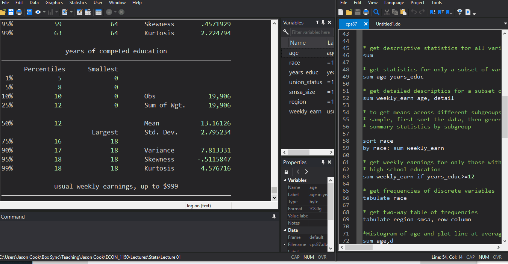

class: inverse, middle

```{r Setup, include = F}
options(htmltools.dir.version = FALSE)
library(pacman)
p_load(ggthemes, viridis, knitr, dslabs, gapminder, extrafont, Ecdat, wooldridge, tidyverse, magrittr)
# Define colors
red_pink <- "#e64173"
met_slate <- "#272822" # metropolis font color 
# Notes directory
dir_slides <- "~/QAMO_UG_Intro_Metrics/Lectures/01-Introduction/"
# Knitr options
opts_chunk$set(
  comment = "#>",
  fig.align = "center",
  fig.height = 7,
  fig.width = 10.5,
  #dpi = 300,
  #cache = T,
  warning = F,
  message = F
)  
```

# Prologue

<!-- install.packages(c("pagedown", "xaringan")) -->
<!-- pagedown::chrome_print("C:/Users/Jason Cook/Box Sync/Teaching/Jason Cook/QAMO_UG_Intro_Metrics/Lectures/01-Introduction/01-Introduction.html") -->

---
# Who am I? 

[**Jason Cook**](https://sites.google.com/site/jasonblainecook/)

- Applied microeconomist and econometrician

- I study the economics of education and public economics.

  - Charter schools
  - Racial segregation
  - Food Assistance: SNAP/WIC

--

Where can you find me?

- **Office hours:** T/Th 3:30-4:30pm or by appointment. Schedule with [__Calendly__](https://calendly.com/jascook/20min)
  + **Zoom Meeting ID:** 331 921 1844
  + **Password:** 4651
- **Email:** .hi[Don't email] __(use Slack Instead!)__

---
class: inverse, middle

# Syllabus

---
layout: true
# Syllabus

---

## Grading
- Attendance .hi[(1 pt per class up to 25 pts - 5%)]
  - Watch entire lecture, either by Zoom or Canvas, or combo
  - Lab days, submit Stata do-file for credit
  - Must be completed before Sunday at midnight following the lecture

---

## Grading continued...

- 6 Problem Sets .hi[(25 pts each - 25%)]
  + Mix of theory and empirical tasks
  + Optional groups of up to 4 .hi[(turn in own responses)]
  + Will drop the lowest-scored problem set

--
- 4 Group Assignments .hi[(25 pts each - 20%)]
  + Assigned a group of 5<sup>†</sup>
  + Open-ended empirical assignments
  + Submit report and video presentation
  + Give feedback on 3 other presentations
.footnote[
[†]: Contact TA if group member isn't helping and we will contact entire group and may dock points to that member
]

--
- Midterm .hi[(100 pts - 20%)]
- Comprehensive Final .hi[(150 pts - 30%)]

---
layout: true
# Slack

---
class: inverse, middle

# Slack

---

- I will utilize Slack for this course rather than email (response guaranteed)

- Please do not email me (you may not get a response)

- Create a Slack Account and join our Workspace [Econ 4651: Fall-2020](https://econ4651-fall-2020.slack.com/join/shared_invite/zt-f657a2hw-bySaT~nbE37819BuYvIxEA#/)

- [Getting Started with Slack](https://slack.com/help/articles/218080037-Getting-started-for-new-members)
---

```{r out.width = '100%', echo = F}

```
- Channels (#) along the left panel organize topics for discussion
- Send Direct Messages in lower left panel


---
## In Class
- We will periodically use Slack in class for polling and other activities, so have it ready

---
## Ettiquete

- Respond to comments and questions in .hi[threads]
  + Hover over message and click thread  icon
- Be kind and professional

- Slack is .hi[judgment-free zone], no such thing as "stupid questions"

- TAs and I will monitor Slack to answer questions as well

- To ask a specific question to me or the TAs, be sure to tag us in the post using @

- Please do answer other students questions and contribute to discussion

- In fact...

---

## Bonus
To help facilitate activity on Slack. At the end of the semester, I will subjectively award up to .hi[25 points] (equivalent to one full problem-set) based on each student's activity on Slack

Activity includes both asking and answering questions, though I'll put more weight on answering

---

## Channels:
- \#admin
- \#announcements
- \#lectures
- \#problem-sets
- \#in-class
- \#random
- \#stata

## Direct Messages:
- Send direct messages jointly to myself .hi[and both TAs] for anything personal questions or concerns
  + TA will usually respond, but I'll step in as needed

---
layout: true
# Zoom

---
class: inverse, middle

# Zoom
---

## Ettiquette
- keep video on
- raise hand 
- use chat feature (TAs will be monitoring chat)
- mic off unless called on


---
layout: true
# Poll Everywhere

---
class: inverse, middle

# Poll Everywhere

---

- I'll use poll everywhere for in-class polling

- These polls are to guage understanding and will not be for points

- No need to enroll in Poll Everywhere, just click links in Slack channel

---
layout: false

# Motivation

## Why study econometrics?

--

1. Develop __skills that employers value__.

--

1. Cultivate __healthy skepticism__.

--

1. Learn about the world using __data__.

???

Government agencies and private firms rely on data to make informed decisions. Requires people who can clean and analyze data, create informative visualizations, and communicate results. .mono[Stata] facilitates these tasks.

When should we trust the findings of a study? Junk science abounds. Blind faith in science and science denialism are harmful. Econometrics gives us a way to evaluate the quality of evidence. Makes us better citizens.

Historically, high quality data were scarce. Econometricians had to think rigorously and creatively about how to learn from less than ideal data. Result: proliferation of robust methods with falsifiable assumptions.

---
# Motivation

## Why study econometrics?

### Provide answers to important questions

--

- Do minimum wage policies __reduce poverty__?

--

- Does the death penalty __deter violent crime__?

--

- Does recreational marijuana __cross state lines__?

--

- Are recessions __good for your health__?

--

- How will global warming __affect the economy__?

--

- Will Donald Trump __win again__?

--

- Do mandatory mask policies __reduce the spread of COVID-19__?

---
# Econometrics

Most econometric inquiry concerns one of two distinct goals:

1. .hi-purple[Prediction:] Accurately .purple[predict] or .purple[forecast] an outcome given a set of predictors. .purple[Given what we know about] $\color{#6A5ACD}{x}$.purple[, what values do we expect] $\color{#6A5ACD}{y}$ .purple[to take?]

1. .hi-green[Causal identification:] .green[Estimate] the effect of an intervention on an outcome. .green[How does] $\color{#007935}{y}$ .green[change when we change] $\color{#007935}{x}$.green[?]

???

__Prediction examples__
Netflix uses information on users and their choices to provide individualized movie recommendations.
Some states use data on defendants to predict pretrial flight risk.
The Federal Reserve uses economic data to forecast inflation, unemployment, and GDP.

__Causal examples__
Pharmaceutical companies run clinical trials to determine whether new medicines reduce symptoms or cause side effects.
Tech companies use __A/B testing__ to improve user experience (and increase profit).
Economists use __natural experiments__ to better understand how people respond to incentives.

--

The main focus of ECON 4651 and QAMO 3030 is causal identification.

--

- But...both rely on a common set of statistical techniques.

---
# Econometrics

## Not all relationships are causal

```{R, spurious, echo = F, dev = "svg", fig.height = 6}
data(divorce_margarine)

ggplot(divorce_margarine, aes(margarine_consumption_per_capita, divorce_rate_maine)) +
  geom_point(size = 4, color = "darkslategray") +
  geom_smooth(method = "lm", se = FALSE, color = red_pink) +
  xlab("Margarine consumption per capita (lbs.)") +
  ylab("Divorce rate in Maine (per 1000)") + 
  theme_pander(base_size = 17, base_family = "Fira Sans", fc = met_slate)
```

---
# Econometrics

## Correlation vs. Causation

Common refrain: _"Correlation doesn't necessarily imply causation!"_

- __Q:__ Why might correlation fail to describe a causal relationship?

--

- __A:__ Omitted-variables bias, selection bias, simultaneity, reverse causality.

--

Correlation can imply causation.

- Requires strong assumptions.

--

- **Real life often violates these assumptions!**

- **Solutions:** Conduct an experiment or find a natural experiment.

---
# Example: *Blue Paradox*

[Recent study](https://www.pnas.org/content/116/12/5319) by economist [Grant McDermott](https://grantmcdermott.com) and coauthors.

**Question:** Do commercial fishers preempt fishing bans by increasing their fishing effort before the bans go into effect?

**Motivation**

- Recent conservation efforts seek to preserve aquatic habitat and increase fish stocks.
- Policy lever: Restrict fishing activity in marine protected areas.
- Concern: Preemptive behavior could *decrease* fish stocks.

--

**Data**

- Vessel-level data on fishing effort/intensity.

---
# Example: *Blue Paradox*

**Natural Experiment**

Phoenix Islands Protected Area (PIPA) 

- First mentioned on 1 September 2014; implemented 1 January 2015.
- *Treatment group:* PIPA.
- *Control group:* Outlying Kiribati islands. 

````{r, out.width = "60%", eval=TRUE, echo=FALSE}

```

---
# Example: *Blue Paradox*

**Natural Experiment**

Measure the causal effect of the fishing ban by comparing fishing effort in treatment and control regions, before-and-after PIPA.

- A *difference-in-differences* comparison.
- .hi[Assumption:] .pink[Parallel trends.] If we believe this assumption, then the observed change supports a causal interpretation. If not, then the change could reflect other factors and thus fail to isolate the causal effect of the ban.

---
# Example: *Blue Paradox*

**Results**

````{r, out.width = "85%", eval=TRUE, echo=FALSE}
include_graphics("figure3.jpg")
```

---
# Example: *Blue Paradox*

**Discussion**

Results provide causal evidence that commercial fishers engage in preemptive behavior in response to conservation policy changes.

Results are *consistent* with economic theory, but *cannot prove* that the theory is correct.

- **Science cannot prove anything.**
- Science can .hi[falsify or reject] existing hypotheses or .hi[corroborate] existing evidence.

--

Also...the causal statement rests on a critical assumption.

- Cannot prove that the assumption is true, but can falsify it.
- Failure to falsify $\neq$ assumption is true.

---

# Econometrics

An applied econometrician<sup>†</sup> needs a solid grasp on (at least) three areas:

1. The __theory__ underlying econometrics (assumptions, results, strengths, weaknesses).

1. How to __apply theoretical methods__ to actual data.

1. Efficient methods for __working with data__—cleaning, aggregating, joining, visualizing.

.footnote[
[†]: _Applied econometrician_ .mono[=] Practitioner of econometrics, _e.g._, analyst, consultant, data scientist.
]

--

__This course__ aims to deepen your knowledge in each of these three areas.

--

- 1: As before.
- 2–3: __.mono[Stata]__

---
class: inverse, middle
background-image: url(https://ritme.com/stock/img/product/162/banniere-stata-16.png)
background-size: contain
background-position: middle

---

# Stata
- There are several statistical packages useful for econometrics, we will use .mono[Stata]
- Concepts learned easily translate to other packages (e.g., R, SAS, SPSS)
- __Useful Resources:__
 + [Stata FAQ](www.stata.com/support/faqs)
 + [The Stata listserv](www.statalist.org)
 + [UCLA's resources for learning Stata](https://stats.idre.ucla.edu/stata/modules/)
- __In Stata:__ CPS data
 + Navigating Stata
 + Help files
 + Do-files


---
# .mono[Stata] - Do File

- Everything you __do__ in .momo[Stata] should be recorded in a __do file__
- The do file should:
  + Begin by opening raw data (source data unedited by user)
  + Perform data cleaning
  + Run analyses and save output
- .hi[__Never__ save over raw data]
- Comment by starting lines with .mono[*] to organize code

```{r out.width = '60%', echo = F}

```
.center[__Opening a do file__]


---

# .mono[Stata] - .mono[help]

- Use the .mono[help] feature liberally
  + Explains what a command does
  + At the end gives examples of using the syntax
  + Sometimes even has video explanations

```{r out.width = '85%', echo = F}

```
.center[__Looking up help file for .mono[summarize] command__]

---
# .mono[Stata] - Basic Operations
- __Generate new variables:__ .mono[gen age2=age*age]
  + Create a variable (.mono[gen]) called .mono[age2] and assign (=) to it the value of .mono[age] times .mono[age] (aka $\text{age}^2$)
  
- __Natural Log:__ .mono[gen ln_weekly_earn=ln(weekly_earn)]

- __Binary Variable:__ .mono[gen union=union_status==1]<sup>*</sup>
  + Create a variable called union that equals 1 if .mono[union_status] equals 1, otherwise assign union_status to be 0

.footnote[[*] .mono[=] "assign"; .mono[==] "compare"]

---
# .mono[Stata] - Basic Operations
- __Logical Conditions (OR):__ `gen nonwhite=race==2 | race==3`
  + Create a variable called `nonwhite` that equals 1 if race equals 2 _OR_ (`|`) 3, otherwise assign `nonwhite` to be 0
  
- __Logical Conditions (AND):__ `gen big\_ne=region==1 & smsa==1`
  + Create a variable called `big_ne` that equals 1 if `region` equals 1 _AND_ (`&`) `smsa` equals 1, otherwise assign `big_ne` to be zero


---

# .mono[Stata] - Summary Statistics
## `summarize, detail`
.pull-left[
- Provides summary statistics of given variable(s), (here, `age`)
- `, detail` option that tells Stata to provide additional info like quantiles
]
.pull-right[
| Age | Education
------------- | -------- | -----
Mean| 37.97| 13.16
Median  |  36|12
Variance |  124.4|7.81
]

```{r out.width = '80%', echo = F}

```
  
---
# .mono[Stata] - Summary Stats by Categories
## `bysort race: sum weekly_earn`
.pull-left[- Runs `sum` command separately for each value of `race` 
- Here `race==1` is white, `race==2` is black, and `race==3` is Hispanic]
.pull-right[Race  | Mean Earnings
------------- | ---------
White| 506.5
Black  |  383.1
Hispanic |  368.6]
```{r out.width = '75%', echo = F}

```
  
---

# .mono[Stata] - .mono[if] Statements
- Add `if` conditions after command to run on subset of data

```{r out.width = '100%', echo = F}

```
  
---

# .mono[Stata] - .mono[tabulate] Command
- Provides counts of observations in each unique value of variable

```{r out.width = '100%', echo = F}

```
  
---

# .mono[Stata] - Figures
- Easiest way to make figures in Stata is using GUI in menu under `Graphics` $\rightarrow$ `Twoway Graph`

```{r out.width = '100%', echo = F}

```
---
# .mono[Stata] - Documenting code
- Organize code into sections
- Use `*` to comment entire lines of code or `\\` to comment out everything following it on the same line
- This can be used to write notes about what the chunk of code is doing

## Example
`*Create new variables`

`gen age2 = age^2 \\other comment here`
 
In the example above, only the `gen age2=age^2` part of the code is executed, Stata will skip over the rest of the text
---
.center[.huge[__Questions?__]]