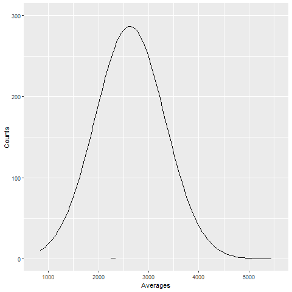

class: inverse, middle

```{r Setup, include = F}
options(htmltools.dir.version = FALSE)
library(pacman)
p_load(transformr ,scales, ggplot2, gganimate, smovie, ggthemes, AER, viridis, knitr, extrafont, tidyverse, magrittr, latex2exp, parallel, Ecdat, wooldridge, dslabs, ggforce)
# Define colors
red_pink <- "#e64173"
met_slate <- "#23373b" # metropolis font color
# Notes directory
dir_slides <- "~/QAMO_UG_Intro_Metrics/Lectures/03-Statistics_Review/"
# Knitr options
opts_chunk$set(
  comment = "#>",
  fig.align = "center",
  fig.height = 7,
  fig.width = 10.5,
  #dpi = 300,
  #cache = T,
  warning = F,
  message = F
)  
theme_simple <- theme_bw() + theme(
  axis.line = element_line(color = met_slate),
  panel.grid = element_blank(),
  rect = element_blank(),
  strip.text = element_blank(),
  text = element_text(family = "Fira Sans", color = met_slate, size = 14),
  axis.text.x = element_text(size = 12),
  axis.text.y = element_text(size = 12),
  axis.ticks = element_blank(),
  plot.title = element_blank(),
  legend.position = "none"
)
theme_empty <- theme_bw() + theme(
  line = element_blank(),
  rect = element_blank(),
  strip.text = element_blank(),
  axis.text = element_blank(),
  plot.title = element_blank(),
  axis.title = element_blank(),
  plot.margin = structure(c(0, 0, -1, -1), unit = "lines", valid.unit = 3L, class = "unit"),
  legend.position = "none"
)
```

# Prologue

<!-- install.packages(c("pagedown", "xaringan")) -->
<!-- pagedown::chrome_print("C:/Users/Jason/Box/Teaching/Jason Cook/QAMO_UG_Intro_Metrics/Lectures/03-Statistics_Review/03-Statistics_Review.html") -->
---
# Housekeeping

Problem Set 1 available on Canvas. Due 9/3 by 5pm.

- Message Blake if you want a group and need help finding one

---
class: inverse, middle

# Statistics Review

---
# Overview

__Goal:__ Learn about a population.

- In particular, learn about an unknown population .hi[parameter].

__Challenge:__ Usually cannot access information about the entire population.

__Solution:__ Sample from the population and estimate the parameter.

- Draw $n$ observations from the population, then use an estimator.

---
# Sampling

There are myriad ways to produce a sample,<sup>*</sup> but we will restrict our attention to __simple random sampling__, where

1. Each observation is a random variable.

2. The $n$ random variables are independent.

3. Life becomes much simpler for the econometrician.

.footnote[
<sup>*</sup> Only a subset of these can help produce reliable statistics.
]

---
# Estimators

An __estimator__ is a rule (or formula) for estimating an unknown population parameter given a sample of data.

--

- Each observation in the sample is a random variable.

--

- An estimator is a combination of random variables $\implies$ it is a random variable.

__Example:__ Sample mean

$$
\bar{X} = \dfrac{1}{n} \sum_{i=1}^n X_i
$$

- $\bar{X}$ is an estimator for the population mean $\mu$.

- Given a sample, $\bar{X}$ yields an __estimate__ $\bar{x}$ or $\hat{\mu}$, a specific number.

---
class: clear-slide, middle

You can think of estimators as trying to hit a bulls-eye at an archery range...

```{R, include = F}
theme_empty_arrows <- theme_bw() + theme(
  line = element_blank(),
  rect = element_blank(),
  strip.text = element_blank(),
  axis.text = element_blank(),
  plot.title = element_blank(),
  axis.title = element_blank(),
  plot.margin = structure(c(0, 0, 0, 0), unit = "lines", valid.unit = 3L, class = "unit"),
  legend.position = "none",
  aspect.ratio = 1
)

circle <- function(center = c(0, 0), diameter = 1, n = 1000){
  r <-  diameter / 2
  tt <- seq(0,2*pi,length.out = n)
  xx <- center[1] + r * cos(tt)
  yy <- center[2] + r * sin(tt)
  return(data.frame(x = xx, y = yy))
}

ring1 <- circle(diameter = 1)
ring2 <- circle(diameter = 2)
ring3 <- circle(diameter = 3)
ring4 <- circle(diameter = 4)
ring5 <- circle(diameter = 5)

arrow1 <- tibble(
  x = -2.25,
  y = 0
)
arrow2 <- tibble(
  x = 2.25,
  y = 0
)
arrows_u_lv <- tibble(
  x = rnorm(10, mean = 0, sd = 0.25),
  y = rnorm(10, mean = 0, sd = 0.25)
) %>% filter(abs(y) <= 2.5 & abs(x) <= 2.5)
arrows_b_lv <- tibble(
  x = rnorm(10, mean = 1, sd = 0.25),
  y = rnorm(10, mean = 1, sd = 0.25)
) %>% filter(abs(y) <= 2.5 & abs(x) <= 2.5)
arrows_b_hv <- tibble(
  x = rnorm(10, mean = 1, sd = 1),
  y = rnorm(10, mean = 0, sd = 0.75)
) %>% filter(abs(y) <= 2.5 & abs(x) <= 2.5)
arrows_u_hv <- tibble(
  x = rnorm(10, mean = 0, sd = 1),
  y = rnorm(10, mean = 0, sd = 1)
) %>% filter(abs(y) <= 2.5 & abs(x) <= 2.5)
```

```{R, echo = F, fig.fullwidth = T, dev = "svg"}
ggplot() + 
  geom_polygon(data = filter(ring5, abs(x) > abs(ring4$x) & abs(y) > abs(ring4$y)), aes(x, y), color = met_slate, fill = "white", alpha = 1, size = 1) +
  geom_polygon(data = filter(ring4, abs(x) > abs(ring3$x) & abs(y) > abs(ring3$y)), aes(x, y), color = "grey55", fill = "grey55", alpha = 1, size = 0) +
  geom_polygon(data = filter(ring3, abs(x) > abs(ring2$x) & abs(y) > abs(ring2$y)), aes(x, y), color = "#07506F", fill = "#07506F", alpha = 1, size = 0) +
  geom_polygon(data = filter(ring2, abs(x) > abs(ring1$x) & abs(y) > abs(ring1$y)), aes(x, y), color = "#b92e34", fill = "#b92e34", alpha = 1, size = 0) +
  geom_polygon(data = ring1, aes(x, y), color = "#D7AA27", fill = "#D7AA27", alpha = 1, size = 0) +
  # geom_point(data = arrow1, aes(x, y), shape = 4, size = 8) +
  # geom_point(data = arrow1, aes(x, y), size = 3) +
  # geom_point(data = arrow2, aes(x, y), shape = 4, size = 8) +
  # geom_point(data = arrow2, aes(x, y), size = 3) +
  theme_empty_arrows
```

---
class: clear-slide, middle
count: false

You can think of estimators as trying to hit a bulls-eye at an archery range...

```{R, echo = F, fig.fullwidth = T, dev = "svg"}
ggplot() + 
  geom_polygon(data = filter(ring5, abs(x) > abs(ring4$x) & abs(y) > abs(ring4$y)), aes(x, y), color = met_slate, fill = "white", alpha = 1, size = 1) +
  geom_polygon(data = filter(ring4, abs(x) > abs(ring3$x) & abs(y) > abs(ring3$y)), aes(x, y), color = "grey55", fill = "grey55", alpha = 1, size = 0) +
  geom_polygon(data = filter(ring3, abs(x) > abs(ring2$x) & abs(y) > abs(ring2$y)), aes(x, y), color = "#07506F", fill = "#07506F", alpha = 1, size = 0) +
  geom_polygon(data = filter(ring2, abs(x) > abs(ring1$x) & abs(y) > abs(ring1$y)), aes(x, y), color = "#b92e34", fill = "#b92e34", alpha = 1, size = 0) +
  geom_polygon(data = ring1, aes(x, y), color = "#D7AA27", fill = "#D7AA27", alpha = 1, size = 0) +
  geom_point(data = arrow1, aes(x, y), shape = 4, size = 8) +
  geom_point(data = arrow1, aes(x, y), size = 3) +
  # geom_point(data = arrow2, aes(x, y), shape = 4, size = 8) +
  # geom_point(data = arrow2, aes(x, y), size = 3) +
  theme_empty_arrows
```

---
class: clear-slide, middle
count: false

You can think of estimators as trying to hit a bulls-eye at an archery range...

```{R, echo = F, fig.fullwidth = T, dev = "svg"}
ggplot() + 
  geom_polygon(data = filter(ring5, abs(x) > abs(ring4$x) & abs(y) > abs(ring4$y)), aes(x, y), color = met_slate, fill = "white", alpha = 1, size = 1) +
  geom_polygon(data = filter(ring4, abs(x) > abs(ring3$x) & abs(y) > abs(ring3$y)), aes(x, y), color = "grey55", fill = "grey55", alpha = 1, size = 0) +
  geom_polygon(data = filter(ring3, abs(x) > abs(ring2$x) & abs(y) > abs(ring2$y)), aes(x, y), color = "#07506F", fill = "#07506F", alpha = 1, size = 0) +
  geom_polygon(data = filter(ring2, abs(x) > abs(ring1$x) & abs(y) > abs(ring1$y)), aes(x, y), color = "#b92e34", fill = "#b92e34", alpha = 1, size = 0) +
  geom_polygon(data = ring1, aes(x, y), color = "#D7AA27", fill = "#D7AA27", alpha = 1, size = 0) +
  geom_point(data = arrow1, aes(x, y), shape = 4, size = 8) +
  geom_point(data = arrow1, aes(x, y), size = 3) +
  geom_point(data = arrow2, aes(x, y), shape = 4, size = 8) +
  geom_point(data = arrow2, aes(x, y), size = 3) +
  theme_empty_arrows
```

---
class: clear-slide, middle

.pull-left[
.center[**Archer 1**]
```{R, echo = F, fig.fullwidth = T, dev = "svg"}
ggplot() + 
  geom_polygon(data = filter(ring5, abs(x) > abs(ring4$x) & abs(y) > abs(ring4$y)), aes(x, y), color = met_slate, fill = "white", alpha = 1, size = 1) +
  geom_polygon(data = filter(ring4, abs(x) > abs(ring3$x) & abs(y) > abs(ring3$y)), aes(x, y), color = "grey55", fill = "grey55", alpha = 1, size = 0) +
  geom_polygon(data = filter(ring3, abs(x) > abs(ring2$x) & abs(y) > abs(ring2$y)), aes(x, y), color = "#07506F", fill = "#07506F", alpha = 1, size = 0) +
  geom_polygon(data = filter(ring2, abs(x) > abs(ring1$x) & abs(y) > abs(ring1$y)), aes(x, y), color = "#b92e34", fill = "#b92e34", alpha = 1, size = 0) +
  geom_polygon(data = ring1, aes(x, y), color = "#D7AA27", fill = "#D7AA27", alpha = 1, size = 0) +
  geom_point(data = arrows_u_lv, aes(x, y), shape = 4, size = 10) +
  geom_point(data = arrows_u_lv, aes(x, y), size = 4) +
  theme_empty_arrows
```

.center[**Archer 3**]
```{R, echo = F, fig.fullwidth = T, dev = "svg"}
ggplot() + 
  geom_polygon(data = filter(ring5, abs(x) > abs(ring4$x) & abs(y) > abs(ring4$y)), aes(x, y), color = met_slate, fill = "white", alpha = 1, size = 1) +
  geom_polygon(data = filter(ring4, abs(x) > abs(ring3$x) & abs(y) > abs(ring3$y)), aes(x, y), color = "grey55", fill = "grey55", alpha = 1, size = 0) +
  geom_polygon(data = filter(ring3, abs(x) > abs(ring2$x) & abs(y) > abs(ring2$y)), aes(x, y), color = "#07506F", fill = "#07506F", alpha = 1, size = 0) +
  geom_polygon(data = filter(ring2, abs(x) > abs(ring1$x) & abs(y) > abs(ring1$y)), aes(x, y), color = "#b92e34", fill = "#b92e34", alpha = 1, size = 0) +
  geom_polygon(data = ring1, aes(x, y), color = "#D7AA27", fill = "#D7AA27", alpha = 1, size = 0) +
  geom_point(data = arrows_b_lv, aes(x, y), shape = 4, size = 10) +
  geom_point(data = arrows_b_lv, aes(x, y), size = 4) +
  theme_empty_arrows
```
]

.pull-right[
.center[**Archer 2**]
```{R, echo = F, fig.fullwidth = T, dev = "svg"}
ggplot() + 
  geom_polygon(data = filter(ring5, abs(x) > abs(ring4$x) & abs(y) > abs(ring4$y)), aes(x, y), color = met_slate, fill = "white", alpha = 1, size = 1) +
  geom_polygon(data = filter(ring4, abs(x) > abs(ring3$x) & abs(y) > abs(ring3$y)), aes(x, y), color = "grey55", fill = "grey55", alpha = 1, size = 0) +
  geom_polygon(data = filter(ring3, abs(x) > abs(ring2$x) & abs(y) > abs(ring2$y)), aes(x, y), color = "#07506F", fill = "#07506F", alpha = 1, size = 0) +
  geom_polygon(data = filter(ring2, abs(x) > abs(ring1$x) & abs(y) > abs(ring1$y)), aes(x, y), color = "#b92e34", fill = "#b92e34", alpha = 1, size = 0) +
  geom_polygon(data = ring1, aes(x, y), color = "#D7AA27", fill = "#D7AA27", alpha = 1, size = 0) +
  geom_point(data = arrows_u_hv, aes(x, y), shape = 4, size = 10) +
  geom_point(data = arrows_u_hv, aes(x, y), size = 4) +
  theme_empty_arrows
```

.center[**Archer 4**]
```{R, echo = F, fig.fullwidth = T, dev = "svg"}
ggplot() + 
  geom_polygon(data = filter(ring5, abs(x) > abs(ring4$x) & abs(y) > abs(ring4$y)), aes(x, y), color = met_slate, fill = "white", alpha = 1, size = 1) +
  geom_polygon(data = filter(ring4, abs(x) > abs(ring3$x) & abs(y) > abs(ring3$y)), aes(x, y), color = "grey55", fill = "grey55", alpha = 1, size = 0) +
  geom_polygon(data = filter(ring3, abs(x) > abs(ring2$x) & abs(y) > abs(ring2$y)), aes(x, y), color = "#07506F", fill = "#07506F", alpha = 1, size = 0) +
  geom_polygon(data = filter(ring2, abs(x) > abs(ring1$x) & abs(y) > abs(ring1$y)), aes(x, y), color = "#b92e34", fill = "#b92e34", alpha = 1, size = 0) +
  geom_polygon(data = ring1, aes(x, y), color = "#D7AA27", fill = "#D7AA27", alpha = 1, size = 0) +
  geom_point(data = arrows_b_hv, aes(x, y), shape = 4, size = 10) +
  geom_point(data = arrows_b_hv, aes(x, y), size = 4) +
  theme_empty_arrows
```
]

---
# Population *vs.* Sample

**Question:** Why do we care about *population vs. sample*?

```{R, gen dataset, include = F, cache = T}
# Set population and sample sizes
n_p <- 100
n_s <- 10
# Set the seed
set.seed(12468)
# Generate data
pop_df <- tibble(
  i = 3,
  x = rnorm(n_p, mean = 2, sd = 20),
  row = rep(1:sqrt(n_p), times = sqrt(n_p)),
  col = rep(1:sqrt(n_p), each = sqrt(n_p)),
  s1 = sample(x = c(rep(T, n_s), rep(F, n_p - n_s))),
  s2 = sample(x = c(rep(T, n_s), rep(F, n_p - n_s))),
  s3 = sample(x = c(rep(T, n_s), rep(F, n_p - n_s)))
)
# Means
m0 <- mean(pop_df$x)
m1 <- mean(subset(pop_df$x, pop_df$s1 == T))
m2 <- mean(subset(pop_df$x, pop_df$s2 == T))
m3 <- mean(subset(pop_df$x, pop_df$s3 == T))
# Simulation
set.seed(12468)
sim_df <- mclapply(mc.cores = 1, X = 1:1e4, FUN = function(x, size = n_s) {
  pop_df %>% 
    sample_n(size = size) %>% 
    summarize(mu_hat = mean(x))
}) %>% do.call(rbind, .) %>% as_tibble()
```

.pull-left[

```{R, pop1, echo = F, fig.fullwidth = T, dev = "svg"}
ggplot(data = pop_df, aes(x = row, y = col)) +
geom_point(color = "darkslategray", size = 10) +
theme_empty
```

.center[**Population**]

]

--

.pull-right[

```{R, mean1, echo = F, fig.fullwidth = T, dev = "svg"}
ggplot() +
  geom_histogram(data = pop_df, aes(x), fill = "darkslategray", alpha = 0.50) +
  geom_vline(xintercept = m0, size = 2, color = "darkslategray") +
  theme_empty
```

.center[**Population relationship**]
<br>
$\mu = `r round(m0, 2)`$

]

---
# Population *vs.* Sample

**Question:** Why do we care about *population vs. sample*?

.pull-left[

```{R, sample1, echo = F, fig.fullwidth = T, dev = "svg"}
ggplot(data = pop_df, aes(x = row, y = col, shape = s1)) +
geom_point(color = "darkslategray", size = 10) +
scale_shape_manual(values = c(1, 19)) +
theme_empty
```

.center[**Sample 1:** 10 random individuals]

]

--

.pull-right[

```{R, sample1 mean, echo = F, fig.fullwidth = T, dev = "svg"}
ggplot() +
  geom_histogram(data = pop_df, aes(x), fill = "darkslategray", alpha = 0.50) +
  geom_vline(xintercept = m0, size = 2, color = "darkslategray") +
  geom_histogram(data = subset(pop_df, s1 == T), aes(x), fill = red_pink, alpha = 0.50) +
  geom_vline(xintercept = m1, size = 2, color = red_pink) +
  theme_empty
```

.center[

**Population relationship**
<br>
$\mu = `r round(m0, 2)`$

**Sample relationship**
<br>
$\hat{\mu} = `r round(m1, 2)`$

]

]

---
# Population *vs.* Sample

**Question:** Why do we care about *population vs. sample*?

.pull-left[

```{R, sample2, echo = F, fig.fullwidth = T, dev = "svg"}
ggplot(data = pop_df, aes(x = row, y = col, shape = s2)) +
geom_point(color = "darkslategray", size = 10) +
scale_shape_manual(values = c(1, 19)) +
theme_empty
```

.center[**Sample 2:** 10 random individuals]

]

--

.pull-right[

```{R, sample2 mean, echo = F, fig.fullwidth = T, dev = "svg"}
ggplot() +
  geom_histogram(data = pop_df, aes(x), fill = "darkslategray", alpha = 0.50) +
  geom_vline(xintercept = m0, size = 2, color = "darkslategray") +
  geom_histogram(data = subset(pop_df, s2 == T), aes(x), fill = red_pink, alpha = 0.50) +
  geom_vline(xintercept = m2, size = 2, color = red_pink) +
  theme_empty
```

.center[

**Population relationship**
<br>
$\mu = `r round(m0, 2)`$

**Sample relationship**
<br>
$\hat{\mu} = `r round(m2, 2)`$

]

]

---
# Population *vs.* Sample

**Question:** Why do we care about *population vs. sample*?

.pull-left[

```{R, sample3, echo = F, fig.fullwidth = T, dev = "svg"}
ggplot(data = pop_df, aes(x = row, y = col, shape = s3)) +
geom_point(color = "darkslategray", size = 10) +
scale_shape_manual(values = c(1, 19)) +
theme_empty
```

.center[**Sample 3:** 10 random individuals]

]

--

.pull-right[

```{R, sample3 mean, echo = F, fig.fullwidth = T, dev = "svg"}
ggplot() +
  geom_histogram(data = pop_df, aes(x), fill = "darkslategray", alpha = 0.50) +
  geom_vline(xintercept = m0, size = 2, color = "darkslategray") +
  geom_histogram(data = subset(pop_df, s3 == T), aes(x), fill = red_pink, alpha = 0.50) +
  geom_vline(xintercept = m3, size = 2, color = red_pink) +
  theme_empty
```

.center[

**Population relationship**
<br>
$\mu = `r round(m0, 2)`$

**Sample relationship**
<br>
$\hat{\mu} = `r round(m3, 2)`$

]

]

---
class: clear-slide, middle

Let's repeat this **10,000 times** and then plot the estimates.

(This exercise is called a Monte Carlo simulation.)

---
class: clear-slide, middle

```{R, simulation, echo = F, dev = "svg"}
ggplot() +
  geom_histogram(data = sim_df, aes(mu_hat), fill = red_pink, alpha = 0.75) +
  geom_vline(xintercept = m0, size = 2, color = "darkslategray") +
  scale_x_continuous(breaks = m0, labels = TeX("$\\mu$")) +
  xlab(TeX("$\\hat{\\mu}$")) +
  theme(axis.text.x = element_text(size = 20),
      axis.text.y = element_blank(),
      rect = element_blank(),
      axis.title.y = element_blank(),
      axis.title.x = element_text(size = 20, hjust = 1, color = met_slate),
      line = element_blank())
```

.center[__Sampling Distribution__]
.center[(more on this momentarily)]

---
# Population *vs.* Sample

**Question:** Why do we care about *population vs. sample*?

.pull-left[
```{R, simulation2, echo = F, dev = "svg"}
ggplot() +
  geom_histogram(data = sim_df, aes(mu_hat), fill = red_pink, alpha = 0.75) +
  geom_vline(xintercept = m0, size = 2, color = "darkslategray") +
  scale_x_continuous(breaks = m0, labels = TeX("$\\mu$")) +
  xlab(TeX("$\\hat{\\mu}$")) +
  theme(axis.text.x = element_text(size = 20),
      axis.text.y = element_blank(),
      rect = element_blank(),
      axis.title.y = element_blank(),
      axis.title.x = element_text(size = 20, hjust = 1, color = met_slate),
      line = element_blank())
```
]

.pull-right[

- Mean of the samples are close to the population mean.

- But...some individual samples can miss the mark.

- The difference between individual samples and the population creates __uncertainty__. 

]

---
# Population *vs.* Sample

**Question:** Why do we care about *population vs. sample*?

**Answer:** Uncertainty matters.

- $\hat{\mu}$ is a random variable that depends on the sample.

- In practice, we don't know whether our sample is similar to the population or not. 

- Individual samples may have means that differ greatly from the population.

- We will have to keep track of this uncertainty.

- To do so, we need to discuss __Sampling Distributions__

--

- But first... 

---
# Group Questions

__Describe in your own words what the following terms are and how they connect to each other:__
  - **Population**
  - **Sample**
  - **Parameter**
  - **Estimator**

<!-- --- -->
<!-- # Samples $\rightarrow$ Populations -->

<!-- - It turns out sample estimates provide a great deal of info about populations -->

<!-- - Even more amazingly, we can quantify how certain we should be about our estimates -->

<!-- - This is made possible by two amazing statistical theorems, the _Law of Large Numbers_ and the _Central Limit Theorem_ -->

<!-- --- -->
<!-- # Samples $\rightarrow$ Populations -->

<!-- - It was not an accident that the sample mean was a good estimator for the population mean -->

<!-- - Let's see why -->

<!-- -- -->

<!-- - Consider a single sample average, e.g., average height of a sample of  students -->
<!--   + Recall, __Sample Mean__: $\hat{\mu}=Avg_n(Y_i) = \frac{1}{n}\sum_{i=1}^n Y_i$ -->
<!-- -- -->

<!-- - Want to know the corresponding __population mean__, e.g., average height of all  students, aka, __Expectation__ or __Expected Value__, $\mu$, or $E[Y_i]$ -->

<!-- - Recall, can write Expectations as weighted averages of all possible $Y_i$ values -->
<!--   + Weights given by probability that values appear in the population  -->

<!-- --- -->

<!-- # Samples $\rightarrow$ Populations -->
<!-- ## Definition - Expected Value -->
<!-- > Suppose random variable $Y$ has $k$ possible values, where $y_i$ is the $i_{\text{th}}$ value and $p_i$ is the probability that $Y$ takes on $y_i$, then $$E[Y]=y_1p_1 + y_2p_2 + \cdots + y_kp_k = \sum_{i=1}^k y_ip_i$$ -->

<!-- -- -->

<!-- - __Example:__ Suppose I flip a coin and pay you $100 if heads or $0 if tails, then  -->

<!--   + $E[Y]=\frac{1}{2}*100 + \frac{1}{2}*0=50$ -->
<!--   + Now suppose we play the game 10 times, and win 4 heads, then $Avg_{10}(Y_i)=\frac{1}{10}(100*4 + 0*6)=40$ -->

<!-- - .pink[__Practice Problems (3)__] -->

<!-- --- -->

<!-- # Samples $\rightarrow$ Populations -->
<!-- - $E[Y_i]$ is fixed for a particular population and is called a __parameter__ -->

<!-- - The sample average of $Y_i$, $Avg_n(Y_i)$, aka $\bar{Y}$, varies from one sample to another -->

<!-- - $\bar{Y}$ is a good estimator of $E[Y_i]$, __why?__ -->

<!-- -- -->

---
class: inverse, middle

# Sampling Distribution

---
# Sampling Distribution
## Recap
- We have a _sample_ mean and we are trying to learn about a _population_ mean, but we know there will be uncertainty

## E.g., Average School Size in CA
- Suppose you want to know the average school size in California

- You can imagine that if we took a different samples of schools, average size would be different

- If you did this many times this would create a distribution, we call this the __sampling distribution__

---
# Sampling Distribution
## Number of Students in CA Schools
- To illustrate, consider data on the \# of students in California schools
- Here is the distribution -- heavily skewed
```{r out.width = '90%', echo = F}
library(AER)
data("CASchools")
hist(CASchools$students, breaks=100, main="")
```
---
# Sampling Distribution
## Average \# of Students in CA Schools
- Now suppose we take different samples of schools, calculate the average, and kept track
--
```{r out.width = '55%', echo = F}

```
---
#Sampling Distribution
.pull-left[
```{r out.width = '100%', echo = F}

```
]
.pull-right[
- This is the __sampling distribution__ of our estimator (_the sample average_) for the parameter (_the population average_) 
  + i.e., distribution of all possible sample averages
]

---
#Sampling Distribution
.pull-left[
```{r out.width = '100%', echo = F}

```
]
.pull-right[
## __Note:__
- Data are skewed, but sampling distribution is __normally distributed__ (bell curve)
- Mean of distribution is close to the  population average (~2,500)
- Spread of sampling distribution conveys _uncertainty_
  + i.e., more spread means higher chance any given sample is far away from truth
]

--
.hi[Group Question:] **What is the difference between the distribution of $Y$ and the sampling distribution of $\bar{Y}$?**

---
class: inverse, middle

# Properties of Estimators

---
# Properties of Estimators

**Question:** What properties make an estimator reliable?

**Answer 1: Unbiasedness.**

.pull-left[

**Unbiased estimator:** $\mathop{\mathbb{E}}\left[ \hat{\mu} \right] = \mu$

```{R, unbiased pdf, echo = F, dev = "svg"}
tmp <- tibble(x = seq(-4, 4, 0.01), y = dnorm(x))
tmp <- rbind(tmp, tibble(x = seq(4, -4, -0.01), y = 0))
ggplot(data = tmp, aes(x, y)) +
geom_polygon(fill = red_pink, alpha = 0.9) +
geom_hline(yintercept = 0, color = "black") +
geom_vline(xintercept = 0, size = 1, linetype = "dashed") +
scale_x_continuous(breaks = 0, labels = TeX("$\\mu$")) +
theme_simple +
theme(axis.text.x = element_text(size = 40),
      axis.text.y = element_blank(),
      axis.title = element_blank(),
      line = element_blank())
```

]

--

.pull-right[

**Biased estimator:** $\mathop{\mathbb{E}}\left[ \hat{\mu} \right] \neq \mu$

```{R, biased pdf, echo = F, dev = "svg"}
tmp <- tibble(x = seq(-4, 4, 0.01), y = dnorm(x))
tmp <- rbind(tmp, tibble(x = seq(4, -4, -0.01), y = 0))
ggplot(data = tmp, aes(x, y)) +
geom_polygon(aes(x = x + 2), fill = "darkslategray", alpha = 0.9) +
geom_hline(yintercept = 0, color = "black") +
geom_vline(xintercept = 0, size = 1, linetype = "dashed") +
scale_x_continuous(breaks = 0, labels = TeX("$\\mu$")) +
theme_simple +
theme(axis.text.x = element_text(size = 40),
      axis.text.y = element_blank(),
      axis.title = element_blank(),
      line = element_blank())
```

]

--

- I.e., expected value of sampling distribution = true population parameter

---
# Properties of Estimators
## Sample Average is Unbiased

- Sample average turns out to be unbiased estimator of population average

- Recall: $\hat{\mu} \equiv \bar{Y} \equiv \frac{1}{n}\sum_{i=1}^{n} Y_i\ \text{ and }\ \mu \equiv \mathop{\mathbb{E}}[Y]$

--

- __Proof__: WTS $\mathop{\mathbb{E}}\left[ \hat{\mu} \right] = \mu$ $$\mathop{\mathbb{E}}[\hat{\mu}]=\mathop{\mathbb{E}}\left[\frac{1}{n}\sum_{i=1}^{n} Y_i\right]=\frac{1}{n}\sum_{i=1}^{n} \mathop{\mathbb{E}}\left[Y_i\right]=\frac{1}{n}\sum_{i=1}^{n} \mu= \frac{1}{n} n \mu=\mu.\blacksquare$$

  + By simple properties of expectations (first lecture)

---
# Properties of Estimators

**Question:** What properties make an estimator reliable?

**Answer 2: Low Sampling Variance (a.k.a. Efficiency).**

The central tendencies (means) of competing distributions are not the only things that matter. We also care about the **variance** of an estimator, aka, __sampling variance__ (variance of _sampling distribution_).

$$ \mathop{\text{Var}} \left( \hat{\mu} \right) = \mathop{\mathbb{E}}\left[ \left( \hat{\mu} - \mathop{\mathbb{E}}\left[ \hat{\mu} \right] \right)^2 \right] $$

Lower variance estimators produce estimates closer to the mean in each sample.


---
# Properties of Estimators

**Question:** What properties make an estimator reliable?

**Answer 2: Low Sampling Variance (a.k.a. Efficiency).**

```{R, variance pdf, echo = F, dev = "svg", fig.height = 5}
d4 <- tibble(x = seq(-7.5, 7.5, 0.01), y = dnorm(x, mean = 0, sd = 1)) %>%
  rbind(., tibble(x = seq(7.5, -7.5, -0.01), y = 0))
d5 <- tibble(x = seq(-7.5, 7.5, 0.01), y = dnorm(x, mean = 0, sd = 2)) %>%
  rbind(., tibble(x = seq(7.5, -7.5, -0.01), y = 0))
ggplot() +
geom_polygon(data = d4, aes(x, y), fill = red_pink, alpha = 0.9) +
geom_polygon(data = d5, aes(x, y), fill = "darkslategray", alpha = 0.8) +
geom_hline(yintercept = 0, color = "black") +
geom_vline(xintercept = 0, size = 1, linetype = "dashed") +
scale_x_continuous(breaks = 0, labels = TeX("$\\mu$")) +
theme_simple +
theme(axis.text.x = element_text(size = 20),
      axis.text.y = element_blank(),
      axis.title = element_blank(),
      line = element_blank())
```

---
# Properties of Estimators

## __Sample__ Variance

- __Sample Variance:__ $S(Y_i)^2 = \frac{1}{n-1} \sum_{i=1}^{n}(Y_i - \bar{Y})^2$
  - __In Stata:__ Summarizing data.   `sum Y, detail`
- __Population Variance:__ $V(Y_i) = E\left[(Y_i - E[\bar{Y}])^2\right]=\sigma_Y^2$
  - Unknown parameter
- __Standard Deviation:__ Square root of the variance $\sigma_Y = \sqrt{\sigma_Y^2}$

--

## __Sampling__ Variance of $\hat{\mu}=\bar{Y}$
We want to characterize the variance of  $\bar{Y}$ across repeated samples
+ $V(\bar{Y}) = E\left[(\bar{Y} - E[\bar{Y}])^2\right]=E\left[(\bar{Y} - E[Y_i])^2\right]$
+ By the unbiasedness property
+ $V(\bar{Y})$: variance of sample mean
+ $V(Y_i)$ or $\sigma_Y^2$: population variance of underlying data
	

---
# Properties of Estimators
## __Sampling__ Variance of $\hat{\mu}=\bar{Y}$

- *Sampling* variance is related to *population* variance
$$V(\bar{Y}) = V\left(\frac{1}{n}\sum_{i=1}^n{Y_i}\right) = \frac{1}{n^2} \sum_{i=1}^n V(Y_i)= \frac{1}{n^2} \sum_{i=1}^n \sigma_Y^2=\frac{n \sigma^2_Y}{n^2} = \frac{\sigma^2_Y}{n}$$
	
  + Variance of a sum is the sum of variances
  + Constants are squared when pulled out of a variance
	
- Thus, sampling variance of an average depends on variance of underlying data and number of observations

---
# Properties of Estimators
## Standard Errors

- We usually work with standard deviation of sample mean rather than variances

- __Standard error__ is the standard deviation of an _estimator_<sup>+</sup>

--

- $SE(\bar{Y}) = \sqrt{V(\bar{Y})} = \frac{\sigma_Y}{\sqrt{n}}$

- $\widehat{SE}(\bar{Y}) = \frac{S(Y_i)}{\sqrt{n}}$, Estimated Standard Error

- SE summarize variation in estimate from _random sampling_

- Again, SE $\neq$ standard deviation of underlying data

.footnote[
<sup>+</sup> The estimator we've considered so far is the sample average. More specifically, the standard error is the standard deviation of the _sampling distribution_ of an estimator.
]

---
# Properties of Estimators
## The Bias-Variance Tradeoff

Should we be willing to take a bit of bias to reduce the variance?

In econometrics, we generally prefer unbiased estimators. Some other disciplines think more about this tradeoff.

```{R, variance bias, echo = F, dev = "svg", fig.height = 4.5}
d4 <- tibble(x = seq(-7.5, 7.5, 0.01), y = dnorm(x, mean = 0.3, sd = 1)) %>%
  rbind(., tibble(x = seq(7.5, -7.5, -0.01), y = 0))
d5 <- tibble(x = seq(-7.5, 7.5, 0.01), y = dnorm(x, mean = 0, sd = 2)) %>%
  rbind(., tibble(x = seq(7.5, -7.5, -0.01), y = 0))
ggplot() +
geom_polygon(data = d4, aes(x, y), fill = red_pink, alpha = 0.9) +
geom_polygon(data = d5, aes(x, y), fill = "darkslategray", alpha = 0.8) +
geom_hline(yintercept = 0, color = "black") +
geom_vline(xintercept = 0, size = 1, linetype = "dashed") +
scale_x_continuous(breaks = 0, labels = TeX("$\\mu$")) +
theme_simple +
theme(axis.text.x = element_text(size = 20),
      axis.text.y = element_blank(),
      axis.title = element_blank(),
      line = element_blank())
```
---
# Properties of Estimators

**Question:** What properties make an estimator reliable?

**Answer 3: Consistency.**

- We want uncertainty of our estimator to decrease as $n$ grows.
  + I.e., want probability that estimate $\hat{\mu}_Y$ falls within a small interval around parameter $\mu$ to get increasingly closer to 1 as $n$ grows. 
  
- __Intuition:__ As $n$ grows, our sample size approaches population size $\Rightarrow$ uncertainty should fall

- This is the __Law of Large Numbers (LLN)__


---
# Law of Large Numbers (LLN)
## Law of Large Numbers
> LLN implies that $\bar{Y}$ will be very close to $E[Y_i]$ as the sample size grows

- Let's empirically test LLN let's flip a fair coin 100,000 times 
- Record cumulative average (H=1) (T=0)
- $E[Y_i]=0.5$
---

# LLN

```{r out.width = '100%', echo = F, include = F, eval = T}
tossCoin = function(n=30, p=0.5) {

  # create a probability distribution, a vector of outcomes (H/T are coded using 0/1)
  # and their associated probabilities
  outcomes = c(0,1) # sample space
  probabilities = c(1-p,p)
  
  # create a random sample of n flips; this could also be done with
  # the rbinom() function, but sample() is perhaps more useful
  flips = sample(outcomes,n,replace=T,prob=probabilities)
  
  # now create a cumulative mean vector
  cum_sum = cumsum(flips)
  index = c(1:n)
  cum_mean = cum_sum / index
  
  # now combine the index, flips and cum_mean vectors
  # into a data frame and return it
  # return(data.frame(index,flips,cum_mean))
  return(data.frame(index,cum_mean))
}
ggplotCoinTosses = function(n=30, p=.50) {
  # visualize how cumulative average converges on p  
  # roll the dice n times and calculate means
  trial1 = tossCoin(n,p)
  max_y = ceiling(max(trial1$cum_mean))
  if (max_y < .75) max_y = .75 
  min_y = floor(min(trial1$cum_mean))
  if (min_y > .4) min_y = .4
  
  # calculate last mean and standard error
  last_mean = round(trial1$cum_mean[n],9)
  
  # plot the results together
  plot1 = ggplot(trial1, aes(x=index,y=cum_mean)) +
    geom_line(colour = "blue") +
    geom_abline(intercept=0.5,slope=0, color = 'red', size=.5) +      
    theme(plot.title = element_text(size=rel(1.5)),
          panel.background = element_rect()) +
    labs(x = "n (number of tosses)", 
         y = "Cumulative Average") +
    scale_y_continuous(limits = c(min_y, max_y)) +
    scale_x_continuous(trans = "log10",
                       breaks = trans_breaks("log10",function(x) 10^x),
                       labels = trans_format("log10",math_format(10^.x))) +
    annotate("text",
             label=paste("Cumulative mean =", last_mean,
                         "\nEV =",  p,
                         "\nSample size =", n), 
             y=(max_y - .20), 
             x=10^(log10(n)/2), colour="darkgreen") +
    annotate("text",
           label=paste("P(Heads) with Fair Coin = 0.50"), 
           y=(max_y - .80), 
           x=10^(log10(n)/2), colour="red")

  return(plot1)
}  
```
```{r out.width = '100%', echo = F, eval = T}
# call the function; let's use a fair coin
ggplotCoinTosses(100000, .50)
```

---

# LLN

```{r out.width = '100%', echo = F, eval = T}
# call the function; let's use a fair coin
ggplotCoinTosses(100000, .50)
```

---
# LLN - Analytic Proof

- We've shown that *sampling* variance can be written as
$$V(\bar{Y}) = \frac{\sigma^2_Y}{n}$$
	
- LLN at work, large $n$ implies little dispersion
  
  + As $n\rightarrow \infty$, $V(\bar{Y})\rightarrow 0$

---
# LLN - One More Visualization
```{r out.width = '58%', echo = F}
knitr::include_graphics("figs/sampleDistNormal.gif")
```
- __.red[Red line:]__ Mean of Sample. __.blue[Blue line:]__ Mean of Sampling Distribution. 
- __True Population Mean:__ $\mu=0$

---
# Unbiased Estimators

In addition to the sample mean and sample variance, there are several other unbiased estimators we will use often.

- __Sample covariance__ to estimate covariance $\sigma_{XY}$.

- __Sample correlation__ to estimate the population correlation coefficient $\rho_{XY}$.

---
# Unbiased Estimators

The sample covariance $S_{XY}$ is an unbiased estimator of the population covariance $\sigma_{XY}$:


$$S_{XY} = \dfrac{1}{n-1} \sum_{i=1}^{n} (X_i - \bar{X})(Y_i - \bar{Y}).$$
---
# Unbiased Estimators

The sample correlation $r_{XY}$ is an unbiased estimator of the population correlation coefficient $\rho_{XY}$:

$$r_{XY} = \dfrac{S_{XY}}{\sqrt{S_X^2} \sqrt{S_Y^2}}.$$
---
# Unbiased Estimators

## Poll Questions (1)

--

<iframe src="https://embed.polleverywhere.com/multiple_choice_polls/mI9Mxi2TAHLao5ciGaEYF?controls=none&short_poll=true" width="800" height="600" frameBorder="0"></iframe>

---
#Unbiased Estimators

Sorry, lots of questions. It is so easy to lose the forest for the trees with all of these statistical concepts

## Group Questions
1. .pink[__How does the LLN help us learn about populations using samples?__]

1. __.pink[What is a standard error and why is it useful?]__

--

Okay, we are ready to actually be researchers and test some hypotheses! Next time.
