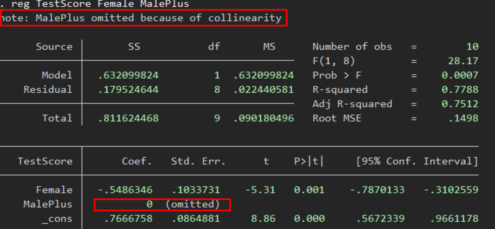

class: white-slide

Instead of waiting in awkward silence for everyone to join, enjoy this live panda footage

<iframe width="914" height="514" src="https://www.youtube.com/embed/Gm3bQVANtVo" frameborder="0" allow="accelerometer; autoplay; encrypted-media; gyroscope; picture-in-picture" allowfullscreen></iframe>
<!-- install.packages(c("pagedown", "xaringan")) -->
<!-- pagedown::chrome_print("C:/Users/Jason/Box/Teaching/Jason Cook/QAMO_UG_Intro_Metrics/Lectures/12-Categorical_Variables/12-Categorical_Variables.html") -->


---
class: inverse, middle

```{r Setup, include = F}
options(htmltools.dir.version = FALSE)
library(pacman)
p_load(ggthemes, viridis, knitr, extrafont, tidyverse, magrittr, wooldridge, stargazer, latex2exp, parallel, broom, kableExtra, ggforce, furrr, magick, Cairo, gganimate, dagitty, ggdag, jtools, scales)
# Define colors
red_pink <- "#e64173"
turquoise <- "#20B2AA"
orange <- "#FFA500"
red <- "#fb6107"
blue <- "#2b59c3"
green <- "#8bb174"
grey_light <- "grey70"
grey_mid <- "grey50"
grey_dark <- "grey20"
purple <- "#6A5ACD"
met_slate <- "#23373b" # metropolis font color
# Knitr options
opts_chunk$set(
  comment = "#>",
  fig.align = "center",
  fig.height = 7,
  fig.width = 10.5,
  #dpi = 300,
  #cache = T,
  warning = F,
  message = F
)  
theme_simple <- theme_bw() + theme(
  axis.line = element_line(color = met_slate),
  panel.grid = element_blank(),
  rect = element_blank(),
  strip.text = element_blank(),
  text = element_text(family = "Fira Sans", color = met_slate, size = 14),
  axis.text.x = element_text(size = 12),
  axis.text.y = element_text(size = 12),
  axis.ticks = element_blank(),
  plot.title = element_blank(),
  legend.position = "none"
)
theme_empty <- theme_bw() + theme(
  line = element_blank(),
  rect = element_blank(),
  text = element_text(family = "Fira Sans", color = met_slate, size = 14),
  strip.text = element_blank(),
  axis.text = element_blank(),
  plot.title = element_blank(),
  axis.title = element_blank(),
  plot.margin = structure(c(0, 0, -1, -1), unit = "lines", valid.unit = 3L, class = "unit"),
  legend.position = "none"
)
theme_metro <- function(x) {
  theme_minimal() + 
  theme(panel.background = element_rect(color = '#FAFAFA',fill='#FAFAFA'),
        plot.background = element_rect(color = '#FAFAFA',fill='#FAFAFA'),
        text = element_text(size = 16),
        axis.title.x = element_text(hjust = 1),
        axis.title.y = element_text(hjust = 1, angle = 0))
}
theme_void_metro <- function(x) {
  theme_void() + 
  theme(panel.background = element_rect(color = '#FAFAFA',fill='#FAFAFA'),
        plot.background = element_rect(color = '#FAFAFA',fill='#FAFAFA'),
        text = element_text(size = 16))
}
theme_metro_regtitle <- function(x) {
  theme_minimal() + 
  theme(panel.background = element_rect(color = '#FAFAFA',fill='#FAFAFA'),
        plot.background = element_rect(color = '#FAFAFA',fill='#FAFAFA'),
        text = element_text(size = 16))
}
# Card data
data('card')
wage_data <- card %>% 
  mutate(nonblack = ifelse(black == 0, 1, 0))

# MI school funding and test scores data
data('meap01')

crop <- function(im, left = 0, top = 0, right = 0, bottom = 0) {
 d <- dim(im[[1]]); w <- d[2]; h <- d[3]
 image_crop(im, glue::glue("{w-left-right}x{h-top-bottom}+{left}+{top}"))
}
```

# Prologue

---
# Housekeeping

## Midterm

Review lecture on Tuesday (10/27).

Exam on Thursday (10/29).

- Because of new test format, no cheat sheet. .hi[Sorry!] But I will provide formula sheet (.hi[Posted on Canvas now])

- Sign-up for a midterm slot with [survey](https://forms.gle/oeUziaCoMKgDFKwC8)

**These slides are last of material covered on exam**

---
class: inverse, middle

# Categorical ("Dummy") Variables
--

```{r out.width = '70%', echo = F}
knitr::include_graphics("https://media.giphy.com/media/5xrkJe3IJKSze/source.gif")
```

---
layout: true
# Categorical ("Dummy") Variables
---

**Goal:** Make quantitative statements about .pink[qualitative information].

- *e.g.,* race, gender, being employed, living in Utah, *etc.*

--

**Approach:** Construct .pink[binary variables].

- _a.k.a._ .pink[dummy variables] or .pink[indicator variables].
- Value equals 1 if observation is in the category or 0 if otherwise.

--

**Regression implications**

1. Binary variables change the interpretation of the intercept.

2. Coefficients on binary variables have different interpretations than those on continuous variables.

---
layout: true
# Continuous Variables
---

Consider the relationship

$$ \text{TestScores}_i = \beta_0 + \beta_1 \text{School}_i + u_i $$

where

- $\text{TestScores}_i$ is a continuous variable measuring an individual's standardized test score
- $\text{School}_i$ is a continuous variable that measures years of education

--

**Interpretation**

- $\beta_0$: $y$-intercept, _i.e._, $\text{TestScores}$ when $\text{School} = 0$
- $\beta_1$: expected increase in $\text{TestScores}$ for a one-unit increase in $\text{School}$

---

Consider the relationship

$$ \text{TestScores}_i = \beta_0 + \beta_1 \text{School}_i + u_i $$

**Derive the slope's interpretation:**

$\mathop{\mathbb{E}}\left[ \text{TestScores} | \text{School} = \ell + 1 \right] - \mathop{\mathbb{E}}\left[ \text{TestScores} | \text{School} = \ell \right]$
--
<br> $\quad = \mathop{\mathbb{E}}\left[ \beta_0 + \beta_1 (\ell + 1) + u \right] - \mathop{\mathbb{E}}\left[ \beta_0 + \beta_1 \ell + u \right]$
--
<br> $\quad = \left[ \beta_0 + \beta_1 (\ell + 1) \right] - \left[ \beta_0 + \beta_1 \ell \right]$
--
<br> $\quad = \beta_0 - \beta_0 + \beta_1 \ell - \beta_1 \ell + \beta_1$
--
<br> $\quad = \beta_1$.

--

The slope gives the expected increase in test scores for an additional year of schooling.

---

Consider the relationship

$$ \text{TestScores}_i = \beta_0 + \beta_1 \text{School}_i + u_i $$

**Alternative derivation**

Differentiate the model with respect to schooling:

$$ \dfrac{d\text{TestScores}}{d\text{School}} = \beta_1 $$

The slope gives the expected increase in TestScores for an additional year of schooling.

---

If we have multiple explanatory variables, _e.g._,

$$ \text{TestScores}_i = \beta_0 + \beta_1 \text{School}_i + \beta_2 \text{Ability}_i + u_i $$

then the interpretation changes slightly.

--

$\mathop{\mathbb{E}}\left[ \text{TestScore} | \text{School} = \ell + 1, \text{Ability} = \alpha \right] - \mathop{\mathbb{E}}\left[ \text{TestScore} | \text{School} = \ell, \text{Ability} = \alpha \right]$
--
<br> $\quad = \mathop{\mathbb{E}}\left[ \beta_0 + \beta_1 (\ell + 1) + \beta_2 \alpha + u \right] - \mathop{\mathbb{E}}\left[ \beta_0 + \beta_1 \ell + \beta_2 \alpha + u \right]$
--
<br> $\quad = \left[ \beta_0 + \beta_1 (\ell + 1) + \beta_2 \alpha \right] - \left[ \beta_0 + \beta_1 \ell + \beta_2 \alpha \right]$
--
<br> $\quad = \beta_0 - \beta_0 + \beta_1 \ell - \beta_1 \ell + \beta_1 + \beta_2 \alpha - \beta_2 \alpha$
--
<br> $\quad = \beta_1$

--

The slope gives the expected increase in Test Scores for an additional year of schooling, **holding ability constant**.

---

If we have multiple explanatory variables, _e.g._,

$$ \text{TestScores}_i = \beta_0 + \beta_1 \text{School}_i + \beta_2 \text{Ability}_i + u_i $$

then the interpretation changes slightly.

**Alternative derivation**

Differentiate the model with respect to schooling:

$$ \dfrac{\partial\text{TestScores}}{\partial\text{School}} = \beta_1 $$

The slope gives the expected increase in Test Scores for an additional year of schooling, **holding ability constant**.

---
layout: true
# Categorical ("Dummy") Variables
---


Consider the relationship

$$ \text{TestScores}_i = \beta_0 + \beta_1 \text{Female}_i + u_i $$

where $\text{TestScores}_i$ is a continuous variable measuring an individual's 3rd grade math scores and $\text{Female}_i$ is a binary variable equal to $1$ if $i$ identifies as female.

**Interpretation**

$\beta_0$ is the expected $\text{TestScores}$ for males and other gender identities (_i.e._, when $\text{Female} = 0$)<sup>**+**</sup>:

.footnote[**+**: I'll abbreviate male and other gender identities with "Male+"]

$\mathop{\mathbb{E}}\left[ \text{TestScores} | \text{Male}^+ \right]$
--
<br> $\quad = \mathop{\mathbb{E}}\left[ \beta_0 + \beta_1\times 0 + u_i \right]$
--
<br> $\quad = \mathop{\mathbb{E}}\left[ \beta_0 + 0 + u_i \right] \quad = \quad \beta_0$

---

Consider the relationship

$$ \text{TestScores}_i = \beta_0 + \beta_1 \text{Female}_i + u_i $$

where $\text{TestScores}_i$ is a continuous variable measuring an individual's 3rd grade math scores and $\text{Female}_i$ is a binary variable equal to $1$ when $i$ identifies as female.

**Interpretation**

$\beta_1$ is the expected difference in $\text{TestScores}$ between females and males+:

$\mathop{\mathbb{E}}\left[ \text{TestScores} | \text{Female} \right] - \mathop{\mathbb{E}}\left[ \text{TestScores} | \text{Male}^+ \right]$
--
<br> $\quad = \mathop{\mathbb{E}}\left[ \beta_0 + \beta_1\times 1 + u_i \right] - \mathop{\mathbb{E}}\left[ \beta_0 + \beta_1\times 0 + u_i \right]$
--
<br> $\quad = \mathop{\mathbb{E}}\left[ \beta_0 + \beta_1 + u_i \right] - \mathop{\mathbb{E}}\left[ \beta_0 + 0 + u_i \right]$
--
<br> $\quad = \beta_0 + \beta_1 - \beta_0$
--
<br> $\quad = \beta_1$

---

Consider the relationship

$$ \text{TestScores}_i = \beta_0 + \beta_1 \text{Female}_i + u_i $$

where $\text{TestScores}_i$ is a continuous variable measuring an individual's 3rd grade math scores and $\text{Female}_i$ is a binary variable equal to $1$ when $i$ identifies as female.

**Interpretation**

$\beta_0 + \beta_1$: is the expected $\text{TestScores}$ for females:

$\mathop{\mathbb{E}}\left[ \text{TestScores} | \text{Female} \right]$
--
<br> $\quad = \mathop{\mathbb{E}}\left[ \beta_0 + \beta_1\times 1 + u_i \right]$
--
<br> $\quad = \mathop{\mathbb{E}}\left[ \beta_0 + \beta_1 + u_i \right]$
--
<br> $\quad = \beta_0 + \beta_1$

---

Consider the relationship

$$ \text{TestScores}_i = \beta_0 + \beta_1 \text{Female}_i + u_i $$

**Interpretation**

- $\beta_0$: expected $\text{TestScores}$ for males+ (_i.e._, when $\text{Female} = 0$)
- $\beta_1$: expected difference in $\text{TestScores}$ between females and males+
- $\beta_0 + \beta_1$: expected $\text{TestScores}$ for females
- Males+ are the **reference group**

--

**Note:** If there are no other variables to condition on, then $\hat{\beta}_1$ equals the difference in group means, _e.g._, $\bar{X}_\text{Female} - \bar{X}_{\text{Male}^+}$.

--

**Note<sub>2</sub>:** The *holding all other variables constant* interpretation also applies for categorical variables in multiple regression settings.

---

```{r out.width = '75%', echo = F}

```

---

.hi[Practice Problems (3)]
```{r out.width = '90%', echo = F}
knitr::include_graphics("figs/L9_Pract1.png")
```
- $FRL$ is a dummy equal to one if the student qualifies for free/reduced price lunch
  1. What is the average score for non-FRL-eligible students?
	1. What is the average score for FRL-eligible students?
	1. What is average score for FRL-eligible relative to non-FRL-eligible students?

---

<iframe src="https://embed.polleverywhere.com/multiple_choice_polls/jfRxhNjXPCR3j3ZB8zcZT?controls=none&short_poll=true" width="800" height="600" frameBorder="0"></iframe>
---

<iframe src="https://embed.polleverywhere.com/multiple_choice_polls/fPKRCWyKZm6phKOxNvBhT?controls=none&short_poll=true" width="800" height="600" frameBorder="0"></iframe>

---

<iframe src="https://embed.polleverywhere.com/multiple_choice_polls/KHtfY0vgR7s1Zj4Bdn5jF?controls=none&short_poll=true" width="800" height="600" frameBorder="0"></iframe>
---

<!-- - More generally we have -->
<!-- $$Y_i = \beta_0 + \beta_1 Z_i + u_i$$ -->
<!-- - Conditional expectation of $Y_i$ given a dummy $Z_i$ is -->
<!-- \begin{align*} -->
<!-- &E[Y_i|Z_i=0]=\beta_0\\ -->
<!-- &E[Y_i|Z_i=1]=\beta_0 + \beta_1 -->
<!-- \end{align*} -->
<!-- so that -->
<!-- $$\beta_1 = E[Y_i|Z_i=1] - E[Y_i|Z_i=0]$$ -->
<!-- is the difference in expected $Y_i$ with the dummy on and off -->

<!-- --- -->

<!-- We can also write -->
<!-- \begin{align*} -->
<!-- E[Y_i|Z_i] &= E[Y_i|Z_i=0]+(E[Y_i|Z_i=1] - E[Y_i|Z_i=0])Z_i\\ -->
<!-- &=\beta_0 + \beta_1 Z_i -->
<!-- \end{align*} -->

<!-- - Shows that $E[Y_i|Z_i]$ is linear function of $Z_i$ with slope $\beta_1$ and intercept $\beta_0$ -->

<!-- - Because CEF with single dummy is linear, regression fits CEF perfectly. Thus, regression slope must also be $\beta_1=E[Y_i|Z_i=1] -E[Y_i|Z_i=0]$ -->

<!--   - In words $\beta_1$ gives the difference in average outcomes between both groups -->

<!-- --- -->
<!-- layout: true -->
<!-- # Interpreting Regressions with Dummies -->
<!-- --- -->

<!-- $$Y_i = \beta_0 + \beta_1 Z_i + u_i$$ -->

<!-- - Because the dummy bivariate regression perfectly fits the CEF, it helps with intuition behind interpreting coefficients -->

<!-- \begin{align*} -->
<!-- &E[Y_i|Z_i=0]=\beta_0\\ -->
<!-- &E[Y_i|Z_i=1]=\beta_0 + \beta_1 -->
<!-- \end{align*} -->

<!-- - Thus, the intercept $\beta_0$ gives the average $Y$ value for people with $Z_i=0$ and  $\beta_0 + \beta_1$ gives the average $Y$ value for people with $Z_i=1$ -->

<!-- 	- True in general, intercept is average for group defined by all dummies $=0$ -->

---

$Y_i = \beta_0 + \beta_1 Z_i + u_i$ for binary variable $Z_i = \{\color{#314f4f}{0}, \, \color{#e64173}{1}\}$

```{R, cat data, include = F}
# Set seed
set.seed(1235)
# Sample size
n <- 5e3
# Generate data
cat_df <- tibble(
  x = sample(x = c(0, 1), size = n, replace = T),
  y = 3 + 7 * x + rnorm(n, sd = 2)
)
# Regression
cat_reg <- lm(y ~ x, data = cat_df)
```

```{R, dat plot 1, echo = F, dev = "svg", fig.height = 5.75}
set.seed(12345)
ggplot(data = cat_df, aes(x = x, y = y, color = as.factor(x))) +
geom_jitter(width = 0.3, size = 1.5, alpha = 0.5) +
scale_color_manual(values = c("darkslategrey", red_pink)) +
theme_empty
```

---

$Y_i = \beta_0 + \beta_1 Z_i + u_i$ for binary variable $Z_i = \{\color{#314f4f}{0}, \, \color{#e64173}{1}\}$

```{R, dat plot 2, echo = F, dev = "svg", fig.height = 5.75}
set.seed(12345)
ggplot(data = cat_df, aes(x = x, y = y, color = as.factor(x))) +
geom_jitter(width = 0.3, size = 1.5, alpha = 0.5) +
scale_color_manual(values = c("darkslategrey", red_pink)) +
geom_hline(yintercept = cat_reg$coefficients[1], size = 1, color = "darkslategrey") +
geom_hline(yintercept = cat_reg$coefficients[1] + cat_reg$coefficients[2], size = 1, color = red_pink) +
annotate(
  geom = "text",
  x = 0.5,
  y = -1 + cat_reg$coefficients[1],
  label = TeX("$\\hat{\\beta}_0 = \\bar{\\mathrm{Group}_0}$"),
  size = 7
) +
annotate(
  geom = "text",
  x = 0.5,
  y = 1 + cat_reg$coefficients[1] + cat_reg$coefficients[2],
  label = TeX("$\\hat{\\beta}_0 + \\hat{\\beta}_1 = \\bar{\\mathrm{Group}_1}$"),
  size = 7,
  color = red_pink
) +
theme_empty
```

---
layout: true
# Multiple Regression
---

This intuition extends to categorical variables that take on many values
$$TestScore_i = \beta_0 + \beta_1 Age8_i + \beta_2 Age9_i + u_i$$
- $\beta_0$: average score for 7-year-olds, i.e., group defined by all dummies $=0$

- $\beta_0+\beta_1$: average test score for 8-year-olds

.left-column[

```{r out.width = '100%', echo = F}
"figs/L9_categ.png" %>%
 image_read() %>%
 crop(bottom = 250, right = 310, left=20)
```
]
.right-column[
```{r out.width = '100%', echo = F}
"figs/L9_categ.png" %>%
 image_read() %>%
 crop(top = 385)
```
]

---

$$TestScore_i = \beta_0 + \beta_1 Age8_i + \beta_2 Age9_i + u_i$$

- .hi[Group Questions:] What is interpretation of $\beta_2$? How would you calculate average score for 9-year-olds using regression coefficients?
.left-column[

```{r out.width = '100%', echo = F}
"figs/L9_categ.png" %>%
 image_read() %>%
 crop(bottom = 250, right = 310, left=20)
```
]
.right-column[
```{r out.width = '100%', echo = F}
"figs/L9_categ.png" %>%
 image_read() %>%
 crop(top = 385)
```
]
---

- If we change the set of dummies, the left-out group becomes the new intercept

$$TestScore_i = \beta_0 + \beta_1 Age7_i + \beta_2 Age9_i + u_i$$

.left-column[

```{r out.width = '100%', echo = F}
"figs/L9_categ2.png" %>%
 image_read() %>%
 crop(bottom = 255, right = 310, left=20)
```

]
.right-column[

```{r out.width = '100%', echo = F}
"figs/L9_categ2.png" %>%
 image_read() %>%
 crop(top = 355)
```

]

---
class: white-slide, middle

We can also estimate models with both continuous and categorical variables

---

```{R, gen data, cache = T, include = F}
n <- 1e2
set.seed(1234)
gen_df <- tibble(
  x1 = runif(n = n, min = -3, max = 3),
  x2 = sample(x = c(F, T), size = n, replace = T),
  u  = rnorm(n = n, mean = 0, sd = 1),
  y  = -0.5 + x1 + x2 * 4 + u
)
mean_a <- filter(gen_df, x2 == F)$y %>% mean()
mean_b <- filter(gen_df, x2 == T)$y %>% mean()
gen_df %<>% mutate(y_dm = y - mean_a * (x2 == F) - mean_b * (x2 == T))
```


```{R, mult reg plot 1, dev = "svg", echo = F, fig.height = 5.75}
ggplot(data = gen_df, aes(y = y, x = x1, color = x2, shape = x2)) +
geom_hline(yintercept = 0) +
geom_vline(xintercept = 0) +
annotate("text", x = -0.075, y = 7.75, label = TeX("$Y$"), size = 8) +
annotate("text", x = 2.95, y = 0.3, label = TeX("$X$"), size = 8) +
geom_point(size = 3) +
ylim(c(-4.5, 8)) +
theme_empty +
scale_color_manual(
  expression(X[2]),
  values = c("darkslategrey", red_pink),
  labels = c("A", "B")
) +
scale_shape_manual(
  expression(X[2]),
  values = c(1, 19),
  labels = c("A", "B")
) +
theme(
  text = element_text(size = 20)
)
```

---
count: false

The intercept and categorical variable $Z$ control for the groups' means.

```{R, mult reg plot 2, dev = "svg", echo = F, fig.height = 5.75}
ggplot(data = gen_df, aes(y = y, x = x1, color = x2, shape = x2)) +
geom_hline(yintercept = mean_a, color = "darkslategrey", alpha = 0.5) +
geom_hline(yintercept = mean_b, color = red_pink, alpha = 0.5) +
geom_hline(yintercept = 0) +
geom_vline(xintercept = 0) +
annotate("text", x = -0.075, y = 7.75, label = TeX("$Y$"), size = 8) +
annotate("text", x = 2.95, y = 0.3, label = TeX("$X$"), size = 8) +
geom_point(size = 3) +
ylim(c(-4.5, 8)) +
theme_empty +
scale_color_manual(
  expression(X[2]),
  values = c("darkslategrey", red_pink),
  labels = c("A", "B")
) +
scale_shape_manual(
  expression(X[2]),
  values = c(1, 19),
  labels = c("A", "B")
) +
theme(
  text = element_text(size = 20)
)
```

---
count: false

With groups' means removed:

```{R, mult reg plot 3, dev = "svg", echo = F, fig.height = 5.75}
ggplot(data = gen_df %>% mutate(y = y - 4 * x2), aes(y = y_dm, x = x1)) +
geom_hline(yintercept = 0) +
geom_vline(xintercept = 0) +
annotate("text", x = -0.075, y = 7.75, label = TeX("$Y$"), size = 8) +
annotate("text", x = 2.95, y = 0.3, label = TeX("$X$"), size = 8) +
geom_point(size = 3, aes(color = x2, shape = x2)) +
ylim(c(-4.5, 8)) +
theme_empty +
scale_color_manual(
  expression(X[2]),
  values = c("darkslategrey", red_pink),
  labels = c("A", "B")
) +
scale_shape_manual(
  expression(X[2]),
  values = c(1, 19),
  labels = c("A", "B")
) +
theme(
  text = element_text(size = 20)
)
```

---
count: false

$\hat{\beta}_1$ estimates the relationship between $Y$ and $X$ after controlling for $Z$.

```{R, mult reg plot 4, dev = "svg", echo = F, fig.height = 5.75}
ggplot(data = gen_df %>% mutate(y = y - 4 * x2), aes(y = y_dm, x = x1)) +
geom_smooth(method = lm, se = F, color = "orange") +
geom_hline(yintercept = 0) +
geom_vline(xintercept = 0) +
annotate("text", x = -0.075, y = 7.75, label = TeX("$Y$"), size = 8) +
annotate("text", x = 2.95, y = 0.3, label = TeX("$X$"), size = 8) +
geom_point(size = 3, aes(color = x2, shape = x2)) +
ylim(c(-4.5, 8)) +
theme_empty +
scale_color_manual(
  expression(X[2]),
  values = c("darkslategrey", red_pink),
  labels = c("A", "B")
) +
scale_shape_manual(
  expression(X[2]),
  values = c(1, 19),
  labels = c("A", "B")
) +
theme(
  text = element_text(size = 20)
)
```

---
count: false

Another way to think about it:

```{R, mult reg plot 5, dev = "svg", echo = F, fig.height = 5.75}
ggplot(data = gen_df, aes(y = y, x = x1, color = x2, shape = x2)) +
geom_smooth(method = lm, se = F) +
geom_hline(yintercept = 0) +
geom_vline(xintercept = 0) +
annotate("text", x = -0.075, y = 7.75, label = TeX("$Y$"), size = 8) +
annotate("text", x = 2.95, y = 0.3, label = TeX("$X$"), size = 8) +
geom_point(size = 3) +
ylim(c(-4.5, 8)) +
theme_empty +
scale_color_manual(
  expression(X[2]),
  values = c("darkslategrey", red_pink),
  labels = c("A", "B")
) +
scale_shape_manual(
  expression(X[2]),
  values = c(1, 19),
  labels = c("A", "B")
) +
theme(
  text = element_text(size = 20)
)
```

---
class: white-slide

**Question:** Why not estimate $\text{TestScores}_i = \beta_0 + \beta_1 \text{Female}_i + \beta_2 \text{Male}^+_i  + u_i$?

--

**Answer:** The intercept is a perfect linear combination of $\text{Male}^+_i$ and $\text{Female}_i$

- Violates .pink[no perfect collinearity] assumption.
  - .blue[**More on this later**]. Recall, this makes us divide by 0

- OLS can't estimate all three parameters simultaneously.

- Known as .hi[dummy variable trap].

**Practical solution:** Select a reference category and drop its indicator. 

---
layout: false
# Dummy Variable _Trap?_

Don't worry, .mono[Stata] will bail you out if you include perfectly collinear indicators.

**Example**

```{r out.width = '70%', echo = F}

```

--

Thanks, .mono[Stata].

---
layout: true
# Omitted Variable Bias
---

Just for fun, let's revisit the concept of omitted variables bias in this context

Recall that **omitted variable bias** (OVB) arises when we omit a variable that

1. Affects the outcome variable $Y$

2. Correlates with an explanatory variable $X_j$

Biases OLS estimator of $\beta_j$.

---

**Example**

Let's imagine a simple population model for the amount individual $i$ gets paid

$$ \text{Income}_i = \beta_0 + \beta_1 \text{School}_i + \beta_2 \text{Male}^+_i + u_i $$

where $\text{School}_i$ gives $i$'s years of schooling and $\text{Male}^+_i$ denotes an indicator variable for whether individual $i$ is male or a gender identity other than female.

**Interpretation**

- $\beta_1$: returns to an additional year of schooling (*ceteris paribus*)
- $\beta_2$: premium for being male<sup>+</sup> (*ceteris paribus*)
--

<br>If $\beta_2 > 0$, then there is discrimination against women.

---

**Example, continued**

From the population model

$$ \text{Income}_i = \beta_0 + \beta_1 \text{School}_i + \beta_2 \text{Male}^+_i + u_i $$

An analyst focuses on the relationship between scores and schooling, _i.e._,

$$ \text{Income}_i = \beta_0 + \beta_1 \text{School}_i + \left(\beta_2 \text{Male}^+_i + u_i\right) $$
$$ \text{Income}_i = \beta_0 + \beta_1 \text{School}_i + \varepsilon_i $$

where $\varepsilon_i = \beta_2 \text{Male}^+_i + u_i$.

--

We assumed exogeneity to show that OLS is unbiasedness. But even if $\mathop{\mathbb{E}}\left[ u | X \right] = 0$, it is not necessarily true that $\mathop{\mathbb{E}}\left[ \varepsilon | X \right] = 0$ (false if $\beta_2 \neq 0$).

--

Specifically, $\mathop{\mathbb{E}}\left[ \varepsilon | \text{Male}^+ = 1 \right] = \beta_2 + \mathop{\mathbb{E}}\left[ u | \text{Male}^+ = 1 \right] \neq 0$.
--
 **Now OLS is biased.**

---

Let's try to see this result graphically.

```{R, gen ovb data, include = F, cache = T}
# Set seed
set.seed(12345)
# Sample size
n <- 1e3
# Parameters
beta0 <- 20; beta1 <- 0.5; beta2 <- 10
# Dataset
omit_df <- tibble(
  male = sample(x = c(F, T), size = n, replace = T),
  school = runif(n, 3, 9) - 3 * male,
  TestScores = beta0 + beta1 * school + beta2 * male + rnorm(n, sd = 7)
)
lm_bias <- lm(TestScores ~ school, data = omit_df)
bb0 <- lm_bias$coefficients[1] %>% round(1)
bb1 <- lm_bias$coefficients[2] %>% round(1)
lm_unbias <- lm(TestScores ~ school + male, data = omit_df)
bu0 <- lm_unbias$coefficients[1] %>% round(1)
bu1 <- lm_unbias$coefficients[2] %>% round(1)
bu2 <- lm_unbias$coefficients[3] %>% round(1)
```

The true population model:

$$ \text{Income}_i = `r beta0` + `r beta1` \times \text{School}_i + `r beta2` \times \text{Male}^+_i + u_i $$

The regression model that suffers from omitted-variable bias:

$$ \text{Income}_i = \hat{\beta}_0 + \hat{\beta}_1 \times \text{School}_i + u_i $$

Finally, imagine that women, on average, receive more schooling than men.

---

True model: $\text{Income}_i = `r beta0` + `r beta1` \times \text{School}_i + `r beta2` \times \text{Male}^+_i + u_i$

```{R, plot ovb 1, echo = F, dev = "svg", fig.height = 6}
ggplot(data = omit_df, aes(x = school, y = TestScores)) +
geom_point(size = 2.5, color = "black", alpha = 0.4, shape = 16) +
geom_hline(yintercept = 0) +
geom_vline(xintercept = 0) +
xlab("Schooling") +
ylab("Income") +
theme_empty +
theme(
  axis.title = element_text(size = 18),
  plot.margin = structure(c(0, 0, 0.1, 0), unit = "lines", valid.unit = 3L, class = "unit"),
)
```
---
count: false

Biased regression: $\widehat{\text{Income}}_i = `r bb0` + `r bb1` \times \text{School}_i$

```{R, plot ovb 2, echo = F, dev = "svg", fig.height = 6}
ggplot(data = omit_df, aes(x = school, y = TestScores)) +
geom_point(size = 2.5, color = "black", alpha = 0.4, shape = 16) +
geom_hline(yintercept = 0) +
geom_vline(xintercept = 0) +
geom_smooth(se = F, color = "orange", method = lm) +
xlab("Schooling") +
ylab("Income") +
theme_empty +
theme(
  axis.title = element_text(size = 18),
  plot.margin = structure(c(0, 0, 0.1, 0), unit = "lines", valid.unit = 3L, class = "unit"),
)
```

---
count: false

Recalling the omitted variable: Gender (**<font color="#e64173">female</font>** and **<font color="#314f4f">male</font>**)

```{R, plot ovb 3, echo = F, dev = "svg", fig.height = 6}
ggplot(data = omit_df, aes(x = school, y = TestScores)) +
geom_point(size = 2.5, alpha = 0.8, aes(color = male, shape = male)) +
geom_hline(yintercept = 0) +
geom_vline(xintercept = 0) +
geom_line(stat = "smooth", color = "orange", method = lm, alpha = 0.5, size = 1) +
xlab("Schooling") +
ylab("Income") +
theme_empty +
theme(
  axis.title = element_text(size = 18),
  plot.margin = structure(c(0, 0, 0.1, 0), unit = "lines", valid.unit = 3L, class = "unit"),
) +
scale_color_manual("", values = c(red_pink, "darkslategrey"), labels = c("Female", "Male")) +
scale_shape_manual("", values = c(16, 1), labels = c("Female", "Male"))
```

---
count: false

Recalling the omitted variable: Gender (**<font color="#e64173">female</font>** and **<font color="#314f4f">male</font>**)

```{R, plot ovb 4, echo = F, dev = "svg", fig.height = 6}
ggplot(data = omit_df, aes(x = school, y = TestScores)) +
geom_point(size = 2.5, alpha = 0.8, aes(color = male, shape = male)) +
geom_hline(yintercept = 0) +
geom_vline(xintercept = 0) +
geom_line(stat = "smooth", color = "orange", method = lm, alpha = 0.2, size = 1) +
geom_abline(
  intercept = lm_unbias$coefficients[1],
  slope = lm_unbias$coefficients[2],
  color = red_pink, size = 1
) +
geom_abline(
  intercept = lm_unbias$coefficients[1] + lm_unbias$coefficients[3],
  slope = lm_unbias$coefficients[2],
  color = "darkslategrey", size = 1
) +
xlab("Schooling") +
ylab("Income") +
theme_empty +
theme(
  axis.title = element_text(size = 18),
  plot.margin = structure(c(0, 0, 0.1, 0), unit = "lines", valid.unit = 3L, class = "unit"),
) +
scale_color_manual("", values = c(red_pink, "darkslategrey"), labels = c("Female", "Male")) +
scale_shape_manual("", values = c(16, 1), labels = c("Female", "Male"))
```

---
count: false

Unbiased regression: $\widehat{\text{Income}}_i = `r bu0` + `r bu1` \times \text{School}_i + `r bu2` \times \text{Male}^+_i$

```{R, plot ovb 5, echo = F, dev = "svg", fig.height = 6}
ggplot(data = omit_df, aes(x = school, y = TestScores)) +
geom_point(size = 2.5, alpha = 0.8, aes(color = male, shape = male)) +
geom_hline(yintercept = 0) +
geom_vline(xintercept = 0) +
geom_line(stat = "smooth", color = "orange", method = lm, alpha = 0.2, size = 1) +
geom_abline(
  intercept = lm_unbias$coefficients[1],
  slope = lm_unbias$coefficients[2],
  color = red_pink, size = 1
) +
geom_abline(
  intercept = lm_unbias$coefficients[1] + lm_unbias$coefficients[3],
  slope = lm_unbias$coefficients[2],
  color = "darkslategrey", size = 1
) +
xlab("Schooling") +
ylab("Income") +
theme_empty +
theme(
  axis.title = element_text(size = 18),
  plot.margin = structure(c(0, 0, 0.1, 0), unit = "lines", valid.unit = 3L, class = "unit"),
) +
scale_color_manual("", values = c(red_pink, "darkslategrey"), labels = c("Female", "Male")) +
scale_shape_manual("", values = c(16, 1), labels = c("Female", "Male"))
```

---
layout: true
class: inverse, middle
# Regression with Dummies as a Matching Estimator

---

- Regressions with Dummy controls helps to see why regressions act as matching estimators

- To see this, let's jump back to that complicated model estimating private school returns

---

```{r out.width = '70%', echo = F}
knitr::include_graphics("https://media.giphy.com/media/9oIZRd54OPX3dPNV6p/giphy.gif")
```

---
layout: true
# Regression Anatomy with Dummies
---

- Consider a simplified model from our earlier private schooling example with only dummies

$$Y_i = \alpha + \beta P_i + \sum_{j=1}^{150} \gamma_j GROUP_{ji} + u_i$$
Recall that:
- $Y_i$: Earnings
- $P_i$: Private School Dummy
- $GROUP_{jt}$: Application set dummy

We are interested in estimating the causal relationship of .pink[private college attendance] on .pink[earnings]


---

$$Y_i = \alpha + \beta P_i + \sum_{j=1}^{150} \gamma_j GROUP_{ji} + u_i$$

Coefficient|Average Earnings Among:
----|----
$\alpha$ | .green[**Public**] school students ( $P_i=0$ ) in .pink[**group 0**]
--

$\beta$ | .blue[**Private**] relative to .green[**public**] students in .pink[**group 0**]
--

$\gamma_j$ | .green[**Public**] students in .orange[**group j**] relative to .pink[**group 0**]
--

$\alpha + \gamma_j$ | .green[**Public**] school students ( $P_i=0$ ) in .orange[**group j**]
--

$\alpha + \beta +\gamma_j$ | .blue[**Private**] school students ( $P_i=1$ ) in .orange[**group j**]
--

- Note that Private relative to public student earnings in .orange[**group j**] are also $\beta$ (take difference of last two lines)
	- Linear CEF $\Rightarrow\beta$ is private-relative-to-public earnings for each group
	- OLS acts as .pink[matching estimator] by comparing private to public earnings among students in same $GROUP$

---

$$Y_i = \alpha + \beta P_i + \sum_{j=1}^{150} \gamma_j GROUP_{ji} + u_i$$

- Regression anatomy tells us that $\beta$ is the bivariate coefficient from a regression on $\tilde{P}_i$, i.e., $\beta=\frac{C(\tilde{Y}_i,\tilde{P}_i)}{V(\tilde{P}_i)}$ , where
$$P_i = \delta_0 + \sum_{j=1}^{150} \delta_j GROUP_{ji} + \tilde{P}_i$$
--

- Add second subscript to index groups $j$, e.g., $Y_{ij}$ is earnings of student $i$ in selectivity group $j$

- Because auxiliary regression that generates $\tilde{P}_{ij}$ has a parameter for every possible value of the CEF ( $E[P_i|GROUP_{1i},\cdots,GROUP_{150}]$ ), the auxiliary regression perfectly fits the CEF


---

$$P_i = \delta_0 + \sum_{j=1}^{150} \delta_j GROUP_{ji} + \tilde{P}_i$$

- $\delta_0 + \delta_j$ is the average private school attendance rate among students in group $j$
--

- Thus, the fitted value $\hat{P}_{ij}$ from a regression of $P_{ij}$ on the full set of group dummies is the mean private school attendance rate in each group, $\bar{P}_j$
$$\hat{P}_{ij} = \delta_0 + \sum_{j=1}^{150} \delta_j GROUP_{ji}=\bar{P}_j$$

- Because in general $u_i=Y_i-\hat{Y}_i$, the auxiliary regression residual is then $\tilde{P}_{ij}=P_{ij}-\bar{P}_j$


---

- Finally, regression anatomy gives
$$\beta = \frac{C(\tilde{Y}_{ij},\tilde{P}_{ij})}{V(\tilde{P}_{ij})}=\frac{C(\tilde{Y}_{ij},P_{ij}-\bar{P}_j)}{V(\tilde{P}_{ij})}$$

- Just as if we were to manually sort students into groups and compare public and private students, regression on private attendance with group controls is also a .hi[within-group] procedure

	- .pink[Variation across groups is removed] by subtracting $\bar{P}_j$ to construct $\tilde{P}_{ij}$
	
	- Similar to how we dropped groups C and D, any group where everyone either attends private or public are .pink[uninformative] because $P_{ij} - \bar{P}_j=0$

---
class: inverse, middle
layout: false
# Let's look at this graphically
---

# Between and Within

- Let's pick a few groups and graph this out
- $Y_i$ against $P_i$ for a few groups

```{r, dev = 'CairoPNG', echo=FALSE, out.width = '80%'}
data(crime4)
crime4 %>% 
  filter(county %in% c(1,3,7, 23),
         prbarr < .5) %>%
  group_by(county) %>%
  mutate(label = case_when(
    crmrte == max(crmrte) ~ paste('Group',county),
    TRUE ~ NA_character_
  )) %>%
  ggplot(aes(x =  prbarr, y = crmrte, color = factor(county), label = label)) + 
  geom_point() + 
  geom_text(hjust = -.1, size = 14/.pt) + 
  theme_metro_regtitle() + 
  labs(x = TeX('$P_i$'), 
       y = TeX('$Y_i$')) + 
  #scale_x_continuous(limits = c(.15, 2.5)) + 
  guides(color = FALSE, label = FALSE) + 
  scale_color_manual(values = c('black','blue','red','purple'))
```

---

# Between and Within

- If we analyze overall variation we get this
$$Y_i = \alpha + \beta P_i + u_i$$

```{r, dev = 'CairoPNG', echo=FALSE, out.width = '80%'}
crime4 %>% 
  filter(county %in% c(1,3,7, 23),
         prbarr < .5) %>%
  group_by(county) %>%
  mutate(label = case_when(
    crmrte == max(crmrte) ~ paste('Group',county),
    TRUE ~ NA_character_
  )) %>%
  ggplot(aes(x =  prbarr, y = crmrte, color = factor(county), label = label)) + 
  geom_point() + 
  geom_text(hjust = -.1, size = 14/.pt) + 
  theme_metro_regtitle() + 
  labs(x = TeX('$P_i$'), 
       y = TeX('$Y_i$')) + 
  #scale_x_continuous(limits = c(.15, 2.5)) + 
  guides(color = FALSE, label = FALSE) + 
  scale_color_manual(values = c('black','blue','red','purple')) + 
  geom_smooth(method = 'lm', aes(color = NULL, label = NULL), se = FALSE)
```


---


# Between and Within

- .hi[Between] variation is what we get if we look at the relationship between the *means of each group*, i.e., $\bar{P}_j$

```{r, dev = 'CairoPNG', echo=FALSE, out.width = '80%'}
crime4 %>% 
  filter(county %in% c(1,3,7, 23),
         prbarr < .5) %>%
  group_by(county) %>%
  mutate(label = case_when(
    crmrte == max(crmrte) ~ paste('Group',county),
    TRUE ~ NA_character_
  ),
  mcrm = mean(crmrte),
  mpr = mean(prbarr)) %>%
  ggplot(aes(x =  prbarr, y = crmrte, color = factor(county), label = label)) + 
  geom_point() + 
  geom_text(hjust = -.1, size = 14/.pt) + 
  theme_metro_regtitle() + 
  labs(x = TeX('$P_i$'), 
       y = TeX('$Y_i$')) + 
  #scale_x_continuous(limits = c(.15, 2.5)) + 
  guides(color = FALSE, label = FALSE) + 
  scale_color_manual(values = c('black','blue','red','purple')) + 
  geom_point(aes(x = mpr, y = mcrm), size = 20, shape = 3, color = 'darkorange') + 
  annotate(geom = 'text', x = .3, y = .015, label = TeX('Means Within Each Group, i.e., $\\bar{P}_j$'), color = 'darkorange', size = 14/.pt)
```

---

# Between and Within

- And I mean it! Only look at those means! The individual variation within groups doesn't matter.

```{r, dev = 'CairoPNG', echo=FALSE, out.width = '80%'}
crime4 %>% 
  filter(county %in% c(1,3,7, 23),
         prbarr < .5) %>%
  group_by(county) %>%
  mutate(label = case_when(
    crmrte == max(crmrte) ~ paste('Group',county),
    TRUE ~ NA_character_
  ),
  mcrm = mean(crmrte),
  mpr = mean(prbarr)) %>%
  ggplot(aes(x =  prbarr, y = crmrte, color = factor(county), label = label)) + 
  #geom_point() + 
  #geom_text(hjust = -.1, size = 14/.pt) + 
  theme_metro_regtitle() + 
  labs(x = TeX('$P_i$'), 
       y = TeX('$Y_i$')) + 
  #scale_x_continuous(limits = c(.15, 2.5)) + 
  guides(color = FALSE, label = FALSE) + 
  scale_color_manual(values = c('black','blue','red','purple')) + 
  geom_point(aes(x = mpr, y = mcrm), size = 20, shape = 3, color = 'darkorange') + 
  geom_smooth(aes(color = NULL), method = 'lm', se = FALSE)+
  annotate(geom = 'text', x = .3, y = .02, label = 'OLS Fit on These Four Points', color = 'blue', size = 14/.pt)
```

---
class: clear-slide
layout: false

- .hi[Within] variation goes the other way - it treats those orange crosses as their own individualized sets of axes and only looks at variation *within* group across students!
- We basically slide the crosses over on top of each other and then analyze *that* data

```{r, echo=FALSE, fig.width=5, fig.height=4.5, out.width = '80%'}
cranim <- crime4 %>% 
  filter(county %in% c(1,3,7, 23),
         prbarr < .5) %>%
  mutate(allcrm = mean(crmrte),
         allmpr = mean(prbarr)) %>%
  group_by(county) %>%
  mutate(label = case_when(
    crmrte == max(crmrte) ~ paste('Group',county),
    TRUE ~ NA_character_
  ),
  mcrm = mean(crmrte),
  mpr = mean(prbarr),
  stage = '1. Raw Data')
cranim <- cranim %>%
  bind_rows(cranim %>% 
              mutate(crmrte = crmrte - mcrm + allcrm,
                     prbarr = prbarr - mpr + allmpr,
                     mcrm = allcrm,
                     mpr = allmpr,
                     stage = '2. Remove all between variation'))

p <- ggplot(cranim, aes(x =  prbarr, y = crmrte, color = factor(county), label = label)) + 
  geom_point() + 
  geom_text(hjust = -.1, size = 14/.pt)  + 
  labs(x = TeX('$\\tilde{P}_i$'), 
       y = TeX('$\\tilde{Y}_i$')) + 
  #scale_x_continuous(limits = c(.15, 2.5)) + 
  guides(color = FALSE, label = FALSE) + 
  scale_color_manual(values = c('black','blue','red','purple')) + 
  geom_smooth(aes(color = NULL), method = 'lm', se = FALSE)+
  geom_point(aes(x = mpr, y = mcrm), size = 20, shape = 3, color = 'darkorange') + 
  transition_states(stage) + 
  theme_metro_regtitle()

anim <- animate(p, nframes = 80)
anim
```

---
class: clear-slide
layout: false

## Both regressions are identical

$Y_i = \alpha + \beta P_i + \sum_{j=1}^{150} \gamma_j GROUP_{ji} + u_i$
.pink[and]
$\tilde{Y}_{i} = \alpha + \beta \tilde{P}_{i} + u_i$<sup>**+**</sup> 

.footnote[**+:** where `\\(\tilde{Y}_i = Y_i - \bar{Y}_j\\)` and `\\(\tilde{P}_i = P_i - \bar{P}_j\\)`]

```{r, echo=FALSE, fig.width=5, fig.height=4.5, out.width = '80%'}
anim

```

---
class: clear-slide
layout: false

Okay, that was alot, how is everyone feeling?

```{r out.width = '70%', echo = F}
knitr::include_graphics("https://media.giphy.com/media/26DNdZwSGNdOXJ2py/source.gif")
```

---

# Group Questions
Suppose that sort students into groups, $A$ and $B$, based on the schools they apply and are accepted to. We regress $Y_i = \alpha + \beta P_i + \gamma A_i + u_i$

where everything is defined as before, but $A_i$ is a binary equal to one for students in group $A$
1. Which (combo of) coefficient(s) gives average earnings among private students in group $A$?
1. Which (combo of) coefficient(s) gives average earnings among public students in group $A$?
1. Which (combo of) coefficient(s) gives average earnings among public students in group $B$?
1. Which (combo of) coefficient(s) gives average earnings among private relative to public students	in a given group?
1. Explain intuitively why this OLS regression acts as a matching estimator.

---
layout: false
class: clear-slide, middle

.huge[**Questions?**]
