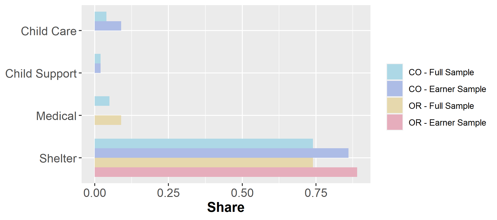

# Disclaimer

> The content is solely the responsibility of the authors and does not necessarily represent the official views of RIDGE, USDA, or the Census Bureau. Results have gone through Census disclosure review under the following release numbers: CBDRB-FY21-POP001-0045,  CBDRB-FY21-POP001-003, and CBDRB-FY21-POP001-0049.

---

```{r, load_refs, include=FALSE, cache=FALSE}
library(RefManageR)
BibOptions(check.entries = FALSE,
         bib.style = "authoryear",
         cite.style = "authoryear",
         max.names = 2,
         sorting = "nty",
         style = "markdown",
         hyperlink = TRUE,
         dashed = TRUE)
bib <- ReadBib("SNAP_WIC.bib", check = FALSE)
```
```{r SNAP_ben0, include = F}
if (!require("pacman")) install.packages("pacman")
pacman::p_load(grid, gridExtra,ggrepel, sp, foreign, dplyr, ggplot2, ggridges, tidyr, forcats, colortools, patchwork, plotly, dygraphs, knitr, kableExtra, formattable,datasets, reactable)

library(ggplot2, grid, reactable)
library(gridExtra)
library(ggridges)
library(dplyr)
library(tidyr)
library(forcats)
library(colortools)
library(patchwork)
library(ggrepel, plotly, dygraphs)
library(knitr, kableExtra, formattable)
library(datasets)

```

# Motivation

- SNAP primary component of U.S. safety net

- In 2019, $60 billion for nutrition benefits to over 36 million people

- Program means-tested $\Rightarrow$ economic theory predicts $\downarrow$ labor supply `r Citep(bib, "Hoynes2015")`

--

- **Qualitative evidence:** Awareness of earnings/benefits trade off

> I was offered a job for $2 more, and then, I had to account for the travel... [I]f I take this job with me spending basically as much money as I’m making, .hi[my SNAP benefits are going to be lowered as well]. So it basically would’ve been me working backwards. [emphasis added] `r Citep(bib, "Caspi2020")`

--

- Sparse literature relating SNAP to labor supply


---

# Literature

## Early Literature

-  Early literature uses structural modeling to link SNAP participation and labor supply decisions `r Citep(bib, "Robert2004")`
--


## Initial Rollout
- More recent work exploits the county-level roll out of the Food Stamp program and finds substantial negative labor supply effects for single mothers `r Citep(bib, "Hoynes2012")`

---


# Literature

## Post Rollout Studies
- Literature studying time period after initial welfare reform also limited

- SNAP expansions among immigrant populations reduce work hours `r Citep(bib, "East2016")`

- Small literature on natives is mixed
  - Little work disincentives `r Citep(bib, c("Scholz2009", "Moffitt2016", "Ben-Shalom2011"))`
  
  - Conversely, SNAP recipients induced to enroll due to increases in the purchasing power of SNAP more likely to be employed full time `r Citep(bib, "Farkhad2018")`
  
---

# Literature

## ABAWDs<sup>.green[**+**]</sup>

- Growing strand of literature assessing effects of work requirements for ABAWDs 

- Mixed results `r Citep(bib, c("Harris2019", "Han2018a", "Stacy2016", "Cuffey2015", "Gray2019", "Stacy2018"))`

--

- No work studying intensive margin effects of SNAP benefits formula

.hi[Why?] Data requirements are substantial hurdle

.footnote[.green[**+**] .hi[ABAWD] = .hi[A]ble-.hi[B]odied .hi[A]dult .hi[W]ithout .hi[D]ependents]

---

# Survey Data


- Much of prior research uses self-reported surveys on earnings and SNAP

- Problematic because self-reported SNAP is under-reported in ways likely not innocuous `r Citep(bib, c("Meyer2015a", "Meyer2007", "Meyer2018a", "Meyer2019", "Haider2008"))`

- Further, to study SNAP benefit formula, need to know monthly income and detailed expenses (e.g., shelter costs) which are .hi[rarely measured]


---

# This Paper

- Study how food assistance program rules influence labor supply

- First assessment of whether .hi-green[SNAP benefit formula] distorts labor supply along .hi-green[intensive margin] <sup>.green[**+**]</sup>

--

- Uses novel, .green[**detailed administrative program data**] for Colorado and Oregon

- .green[**Can observe net income and disregards**], e.g., dependent care and excess shelter cost

- Accurate SNAP eligibility and benefit levels

.footnote[ .green[**+**] .hi[Intensive margin] - how *much* people work as opposed to *whether* they work at all.]

---

# Contribution

- In addition to helping fill gap in SNAP-labor supply literature, also adds to bunching literature

--

## Bunching

- Literature studying intensive margin labor supply distortions in other settings

- Growing public finance literature revitalized by `r Citep(bib, "Saez2010")` studying adjustments to kinks/notches in budget set

- Much of this work focused on taxes, and papers on means tested programs have focused on tax credits requiring work (see review by `r Cite(bib,"Kleven2016")`

- No work that we know of has found evidence of this systematic behavior for safety net programs


---
# Policy Implications

- SNAP designed to reduce labor supply distortions with benefits that fade out as earned income $\uparrow$ `r Citep(bib, "Oliveira2018")`
  
  - Whether there are distortions is an empirical question
  
- Important policy implications for SNAP and for work requirements in the safety net more broadly
  - E.g., Time limits


---
class: inverse, middle

# Understanding SNAP Benefit Formula

---

# Benefit Calculation
- Maximum benefits attached to Dept. of Agriculture Thrifty Food Plan
 
  - Amount to feed family at "minimal cost"

- Families expected to contribute 30 percent of available resources (i.e., .hi[net income]) on food

--

<br>
<br>

**How is net income calculated?**

---

# Benefit Calculation
## Net income Deductions
- **Standard** Deduction - .red[*misc costs*]
  - $167 for 2021, < 3 in SNAP case

- **20% Earned Income** Deduction - .red[*work incentive*]

- **Child Care**, **Child Support**, and **Medical** Deductions  - .red[*rarely used*]

- **Shelter** Deduction

  - Rent/utility costs exceeding half of net income
  
  - Capped at $586 for 2021, unless disabled or elderly case

---
# Share of Cases using each Disregard
.pull-left[
```{r , include = T, echo=F}
options(knitr.kable.NA = '')

Input <- c('Child Care Ded.','Child Support Ded.', 'Medical Ded.', 'Shelter Ded.','N (in millions)')
Share.Full <- c(0.04,0.02,0.05,0.74,5.67)
Share.Earner <- c(0.09,0.02,0,0.86,1.33)
Share.Full.OR <- c(NA,NA,0.09,0.74,49.27)
Share.Earner.OR <- c(NA,NA,0,0.89,10.18)

desc.tab2 <- data.frame(Input, Share.Full, Share.Earner, Share.Full.OR, Share.Earner.OR)

desc.tab2 %>%
  kbl(col.names = c("Sample","Full","Earner","Full","Earner")) %>%
  kable_paper("hover", full_width = F) %>%
  add_header_above(c(" " = 1, "Colorado" = 2, "Oregon" = 2)) %>%
  column_spec(2, color = "black",
              background = "#ADD8E6") %>%
  column_spec(3, color = "black",
              background = "#ADBCE6") %>%
  column_spec(4, color = "black",
              background = "#E6D8AD") %>%
  column_spec(5, color = "black",
              background = "#E6ADBC")
```
]
.pull-right[
```{r out.width = '100%', echo = F}

```
]

- .hi["Earner Sample":] $1+ of earned income and not elderly/disabled case
- .hi[Shelter] is most common deduction outside of earner and standard
  
---
# Average Levels of Net Income Inputs
.pull-left[
```{r , include = T, echo=F}
options(knitr.kable.NA = '')

Input <- c('Earned Income','Unearned Income','Child Care Ded. (>0)','Child Support Ded. (>0)', 'Medical Ded. (>0)', 'Shelter Ded. (>0)')
Amount.Full <- c(329.3, 378.2, 264.7,281.6,347.5,405.1)
Share.Full <- c(NA,NA,0.04,0.02,0.05,0.74)
Amount.Earner <- c(954.8,75.6,244.5,277.4,0,386.1)
Share.Earner <- c(NA,NA,0.09,0.02,0,0.86)
Amount.Full.OR <- c(344.2, 401.5, NA,NA,NA,425.6)
Share.Full.OR <- c(NA,NA,NA,NA,0.09,0.74)
Amount.Earner.OR <- c(1033.0,52.6,NA,NA,NA,412.0)
Share.Earner.OR <- c(NA,NA,NA,NA,0,0.89)

desc.tab <- data.frame(Input, Amount.Full, Amount.Earner, Amount.Full.OR, Amount.Earner.OR)

desc.tab %>%
  kbl(col.names = c("Sample","Full","Earner","Full","Earner")) %>%
  kable_paper("hover", full_width = F) %>%
  add_header_above(c(" " = 1, "Colorado" = 2, "Oregon" = 2)) %>%
  column_spec(2, color = "black",
              background = "#ADD8E6") %>%
  column_spec(3, color = "black",
              background = "#ADBCE6") %>%
  column_spec(4, color = "black",
              background = "#E6D8AD") %>%
  column_spec(5, color = "black",
              background = "#E6ADBC")
```
]
.pull-right[
```{r out.width = '100%', echo = F}

```
]

---
class:white-slide

Mathematically...

First .hi-green["Countable Income"] is calculated

$$CountableInc = UnErnInc + 0.8ErnInc - StdDepChldMedDed$$
--

then the .hi-green[Shelter Deduction] is calculated

$$ShelterDed = min\left[ShelterCap, Shelter Expenses - \frac{CountableInc}{2}\right]$$
 
--

Now, .hi-green[Net Income] can be calculated

$$NI = CountableInc - ShelterDed$$

--

Finally, we can get .hi-green[Benefits]

$$Benefits = max\left[MaxBenefit - 0.3*NI, MinBenefit\right]$$

--

**Note:** Because earned income enters into shelter deduction, .green[**benefit reduction rate** is **steeper** for cases with **shelter deductions**]

---
class:white-slide


```{r SNAP_ben, include = F, echo=F}
## Benefit Budget Set Figure
max_ben_hh3 <- 535
max_exc_shelter <- 586
min_ben_hh3 <- 16
std_ded <- 167
x_y_int_no_ded <- std_ded + max_ben_hh3/.8
unern_inc <- 0
gi_test <- 2353
ni_test <- 1810
shelter_exp <- 586
shelter_exp_large <- 1200

## Plot NI against Earned Income
max_x <- 2700

fun.net_inc <- function(x) {
  cnt_inc <- unern_inc + .8*x - std_ded
  shel_ded <- shelter_exp - cnt_inc/2
  shel_ded[shel_ded<0] <- 0 
  shel_ded[shel_ded>max_exc_shelter] <- max_exc_shelter
  net_inc <- cnt_inc - shel_ded
  net_inc[net_inc<0] <- 0
  net_inc
}
fun.net_inc_large  <- function(x) {
  cnt_inc <- unern_inc + .8*x - std_ded
  shel_ded <- shelter_exp_large - cnt_inc/2
  shel_ded[shel_ded<0] <- 0 
  shel_ded[shel_ded>max_exc_shelter] <- max_exc_shelter
  net_inc <- cnt_inc - shel_ded
  net_inc[net_inc<0] <- 0
  net_inc
}

fun.net_inc_noshel <- function(x) {
  cnt_inc <- unern_inc + .8*x - std_ded
  net_inc <- cnt_inc
  net_inc[net_inc<0] <- 0
  net_inc
}

fun.ben_no_shel <- function(x) {
  cnt_inc <- unern_inc + .8*x - std_ded
  gi <- unern_inc + x
  net_inc <- cnt_inc
  net_inc[net_inc<0] <- 0 
  ben <- max_ben_hh3 - 0.3*net_inc
  ben[ben<min_ben_hh3] <- min_ben_hh3
  ben[gi>gi_test] <- 0
  ben[net_inc>ni_test] <- 0
  ben
}

fun.ben <- function(x) {
  cnt_inc <- unern_inc + .8*x - std_ded
  gi <- unern_inc + x
  shel_ded <- shelter_exp - cnt_inc/2
  shel_ded[shel_ded<0] <- 0 
  shel_ded[shel_ded>max_exc_shelter] <- max_exc_shelter
  net_inc <- cnt_inc - shel_ded
  net_inc[net_inc<0] <- 0 
  ben <- max_ben_hh3 - 0.3*net_inc
  ben[ben<min_ben_hh3] <- min_ben_hh3
  ben[gi>gi_test] <- 0
  ben[net_inc>ni_test] <- 0
  ben
}

fun.ben_big_shel <- function(x) {
  cnt_inc <- unern_inc + .8*x - std_ded
  gi <- unern_inc + x
  shel_ded <- shelter_exp_large - cnt_inc/2
  shel_ded[shel_ded<0] <- 0 
  shel_ded[shel_ded>max_exc_shelter] <- max_exc_shelter
  net_inc <- cnt_inc - shel_ded
  net_inc[net_inc<0] <- 0 
  ben <- max_ben_hh3 - 0.3*net_inc
  ben[ben<min_ben_hh3] <- min_ben_hh3
  ben[gi>gi_test] <- 0
  ben[net_inc>ni_test] <- 0
  ben
}

complementary("steelblue")
#ADD8E6, #E6BBAD
analogous("steelblue")

ni_gi <- ggplot() + 
  stat_function(fun = fun.net_inc_noshel,color="black", linetype="solid", size=2.5) + 
  stat_function(fun = fun.net_inc,color="#B47846", linetype="solid", size=1.5) +
  xlim(0,max_x) +
  theme(plot.title = element_text(hjust = 0.5)) +
  theme(
    axis.text.x  = element_blank(),
    axis.title.x = element_blank(),
    axis.ticks.x = element_blank()
  ) +
  theme(legend.title.align = 0.5) +
  coord_cartesian(clip = "off") + 
  theme_ridges(grid = FALSE, center_axis_labels = TRUE) +
  theme_ridges(center = TRUE) 

ni_gi

#labs(title = "Net Income and Benefits by Earned Income\n (Three-Person Family, No Unearned Income, No Extra Deductions)") + 

ben_gi <- ggplot() + 
  stat_function(fun = fun.ben_no_shel,color="black", linetype="solid", size=2.5) + 
  stat_function(fun = fun.ben,color="#B47846", linetype="solid", size=1.5) + 
  xlim(0,max_x) + 
  ylim(0,600) +
  geom_vline(xintercept = gi_test, linetype='dashed') +
  theme(legend.title.align = 0.5) +
  coord_cartesian(clip = "off") + 
  theme_ridges(grid = FALSE, center_axis_labels = TRUE) +
  theme_ridges(center = TRUE) +
  annotate(geom="text", x=2350, y=500, label="Gross Income\n Limit",
           color="black", angle=-90, size=8) +
  annotate(
    geom = "curve", x = 500, y = 580, xend = 200, yend = 545, size=1.0, color="black", 
    curvature = .3, arrow = arrow(length = unit(2, "mm"))
  ) +
  annotate(
    geom = "curve", x = 700, y = 580, xend = 700, yend = 545, size=1.0, color="#B47846", 
    curvature = 0, arrow = arrow(length = unit(2, "mm"))
  ) +
  annotate(
    geom = "text", x = 200, y = 600, label = "Kink Point of Interest",
    hjust = "left", color="black", size=8
  ) +
  annotate(
    geom = "curve", x = 600, y = 320, xend = 900, yend = 350, size=1.0, color="black", 
    curvature = -0.3, arrow = arrow(length = unit(2, "mm"))
  ) +
  annotate(
    geom = "text", x = 50, y = 300, label = "BRR = 0.24",
    hjust = "left", color="black", size=8
  ) +
  annotate(
    geom = "curve", x = 1450, y = 400, xend = 1150, yend = 400, size=1.0, color="#B47846", 
    curvature = 0.3, arrow = arrow(length = unit(2, "mm"))
  ) +
  annotate(
    geom = "text", x = 1500, y = 400, label = "BRR = 0.36",
    hjust = "left", color="#B47846", size=8
  ) 
ben_gi
```
Let's visualize this for a family of 3 with standard deduction and either
- **No Shelter Expenses** or <span style="color:#B47846">**$600 of Shelter Expenses**</span>

--

.pull-left[
.center[.hi-green[Net Income]]
```{r , include = T, echo=F}
ni_gi
```
.center[**Earned Income**]
]
.pull-right[
.center[.hi-green[Benefit Amount]]
```{r , include = T, echo=F}
ben_gi
```
.center[**Earned Income**]
] 


---
# Maximize Benefits; Net Income $=0$
## Take Away

- With shelter deduction, can have sizeable earnings with full benefits
  
  - Potential scope for bunching behavior

--

- SNAP benefits taxed away **24 cents** on every dollar of *earned* income for households with **no shelter deduction**

- SNAP benefits taxed away <span style="color:#B47846">**36 cents**</span> on every dollar of *earned* income for households with <span style="color:#B47846">**some excess shelter expenses**</span>


--

- Thus, recipients may .hi[bunch at Net Income = 0], i.e., where each additional dollar earned is initially taxed

- Possible .hi[larger effects for households with shelter deduction]

---
# Empirical Design

- Use well-known bunching estimators utilized in other contexts <sup>.hi[*]</sup>
- Augment `r Citet(bib, "Chetty2011")` and estimate
\begin{equation*}
    C_j=\sum_{i=0}^{7}\beta_i\cdot\left(Z_j\right)^i+\sum_{i=-200}^{200}\gamma_i\cdot1\left[Z_j=i\right]+\epsilon_j \label{eq:basicbunch}
\end{equation*}

	- $C_j$: number of respondents in net income bin $j$
	- $Z_j$: net income bin for unit ($50 intervals)
	- Excluded region around net income = 0 is $400

- .green[**Intuition:**] approximate shape of counterfactual bunching region by interpolating the shape from surrounding areas with order 7 polynomial

- Parametric bootstrap for standard errors


.footnote[.hi[*] `r Citet(bib, c("Kleven2016", "Saez2010", "Bertanha2019", "Gelber2017"))`]

---
# Example

```{r out.width = '100%', echo = F}

```

---
class: inverse, middle

# Results

---
# Aggregate Gross/Net Income
<span style="display:block; margin-top:-20px;"></span> 
```{r , include = T, echo=F}
#CO/OR Net Income
st <- 'co_or'
out <- '_rni'
infile <- paste('C:/Users/Jason/Box/SNAP/AEA_PP/disclosure/processed/', st, out, '.dta',sep='')
data_co_or_ni <- read.dta(infile)

co_or_rni <- ggplot(data_co_or_ni, aes(x, y, height = h, group = group , fill=group)) + 
  geom_ridgeline(scale=1800, alpha = 1) + 
  geom_vline(xintercept = 0) +
  scale_fill_cyclical(values = c("lightblue", "#E6BBAD")) +
  scale_x_continuous(expand = c(0, 0), name = 'Net Income') +
  scale_y_discrete(expand = c(0, 0)) +
  coord_cartesian(clip = "off") + 
  theme_ridges(grid = FALSE, center_axis_labels = TRUE) +
  theme(axis.title.y=element_blank(),
        axis.ticks.y = element_blank(),
        axis.text.y = element_blank()) +
  ggtitle('Net Income') +
  annotate(geom="text", x=-430, y=1.3, label="Oregon",
           color="black", angle=0, hjust ='left', size=10) +
  annotate(geom="text", x=-430, y=0.3, label="Colorado",
           color="black", angle=0, hjust ='left', size=10) +
  theme(axis.text = element_text(size=18),
        axis.title = element_text(size=25), 
        plot.title = element_text(size = 40, face = "bold")
  )


#CO/OR Gross Income
st <- 'co_or'
out <- '_rgi'
infile <- paste('C:/Users/Jason/Box/SNAP/AEA_PP/disclosure/processed/', st, out, '.dta',sep='')
data_co_or_gi <- read.dta(infile)

co_or_rgi <- ggplot(data_co_or_gi, aes(x, y, height = h, group = group , fill=group)) + 
  geom_ridgeline(scale=2500, alpha = 1) +
  scale_fill_cyclical(values = c("lightblue", "#E6BBAD")) +
  scale_x_continuous(expand = c(0, 0), name = 'Gross Income') +
  scale_y_discrete(expand = c(0, 0)) +
  coord_cartesian(clip = "off") + 
  theme_ridges(grid = FALSE, center_axis_labels = TRUE) +
  theme(axis.title.y=element_blank(),
        axis.ticks.y = element_blank(),
        axis.text.y = element_blank()) +
  annotate(geom="text", x=70, y=1.3, label="Oregon",
           color="black", angle=0, hjust ='left',size=10) +
  annotate(geom="text", x=70, y=0.3, label="Colorado",
           color="black", angle=0, hjust ='left',size=10) +
  ggtitle('Gross Income') +
  theme(axis.text = element_text(size=18),
        axis.title = element_text(size=25), 
        plot.title = element_text(size = 40, face = "bold")
  )
```
.pull-left[
```{r , include = T, echo=F}
co_or_rgi 
```
]
.pull-right[
```{r , include = T, echo=F}
co_or_rni
```
]

- .hi[Oregon:] Large mass at <$150 Gross (683,000 cases)
  - Not centered at NI=0 so not interpreted as caused by kink
- .hi[Colorado:] Relatively smooth gross income
- .hi[Both:] No noticeable bunching at NI=0

---
# Oregon NI by TANF Receipt

Is this bunching induced by other programs?

--

.center[
```{r out.width = '70%', echo = F}

```
]
<span style="display:block; margin-top:-20px;"></span> 
- **First look:** not the case for TANF recipients in Oregon
- Categorically eligible cases don't exhibit this mass

---
# Net Income by Size of Case

- Possible that labor market frictions differ by .hi-green[family size]

- Especially true for .hi-green[single-person units]

$\Rightarrow$ We might expect heterogeneity in bunching by SNAP case size


---
# Net Income by Size of Case
```{r , include = T, echo=F}
#By case size
st <- 'co'
out <- 'rni'
infile <- paste('C:/Users/Jason/Box/SNAP/AEA_PP/disclosure/processed/', st,'_by_cases_', out, '.dta',sep='')
data_co_casesz_rni <- read.dta(infile)

co_casesz_rni <- ggplot(data_co_casesz_rni, aes(x, group, height = h, group = group , fill=group)) + 
  geom_ridgeline(scale=2000, alpha = 1) + 
  geom_vline(xintercept = 0) +
  scale_fill_cyclical(values = c("#ADD8E6", "#ADBCE6", "#ADE6D7")) +
  scale_x_continuous(expand = c(0, 0), name = 'Net Income') +
  scale_y_discrete(expand = c(0, 0), name= '# in SNAP Unit') +
  coord_cartesian(clip = "off") + 
  theme_ridges(grid = FALSE, center_axis_labels = TRUE) +
  ggtitle('Colorado') +
  theme(axis.text = element_text(size=18),
        axis.title = element_text(size=25), 
        plot.title = element_text(size = 40, face = "bold")
  )
st <- 'or'
out <- 'rni'
infile <- paste('C:/Users/Jason/Box/SNAP/AEA_PP/disclosure/processed/', st,'_by_cases_', out, '.dta',sep='')
data_or_casesz_rni <- read.dta(infile)

or_casesz_rni <- ggplot(data_or_casesz_rni, aes(x, group, height = h, group = group , fill=group)) + 
  geom_ridgeline(scale=2000, alpha = .7) + 
  geom_vline(xintercept = 0) +
  scale_fill_cyclical(values = c("#E6BBAD", "#E6D8AD", "#E6ADBC")) +
  scale_x_continuous(expand = c(0, 0), name = 'Net Income') +
  scale_y_discrete(expand = c(0, 0), name= '# in SNAP Unit') +
  coord_cartesian(clip = "off") + 
  theme_ridges(grid = FALSE, center_axis_labels = TRUE) +
  ggtitle('Oregon') +
  theme(axis.text = element_text(size=18),
        axis.title = element_text(size=25), 
        plot.title = element_text(size = 40, face = "bold")
  )
```
.pull-left[
```{r , include = T, echo=F}
or_casesz_rni
```
- $150 mass are single-unit cases, but not centered at NI=0
]
--

.pull-right[
```{r , include = T, echo=F}
co_casesz_rni 
```

- Possible bunching for single-unit cases (n.s.)
]

--

Let's explore the .hi-green[single-unit bunchers in CO], by .hi-green[self employment income]


---
# CO NI by Self Employment Income 


- Self Employed exhibit most bunching behavior in other contexts `r Citep(bib, "Saez2010","Chetty2011")`

- Colorado provides data on self employment income

--
```{r , include = T, echo=F}
st <- 'co'
out <- 'rni'
infile <- paste('C:/Users/Jason/Box/SNAP/AEA_PP/disclosure/processed/', st,'_by_cases_', out, '_selfemp1.dta',sep='')
data1 <- read.dta(infile)


#CO Self Empoyment
co_selfemp1 <- ggplot(data1, aes(x, group, height = h, group = group , fill=group)) + 
  geom_ridgeline(scale=2000, alpha = 0.7) + 
  geom_vline(xintercept = 0) +
  scale_fill_cyclical(values = c("#ADD8E6", "#ADBCE6")) + 
  theme(legend.title.align = 0.5) +
  scale_x_continuous(expand = c(0, 0), name = 'Net Income') +
  scale_y_discrete(expand = c(0, 0), name= '# in SNAP Unit') +
  coord_cartesian(clip = "off") + 
  theme_ridges(grid = FALSE, center_axis_labels = TRUE) +
  theme_ridges(center = TRUE) +
  ggtitle('Self Emp. Income > 0') +
  theme(axis.text = element_text(size=18),
        axis.title = element_text(size=25), 
        plot.title = element_text(size = 40, face = "bold")
  )

st <- 'co'
out <- 'rni'
infile <- paste('C:/Users/Jason/Box/SNAP/AEA_PP/disclosure/processed/', st,'_by_cases_', out, '_selfemp0.dta',sep='')
data0 <- read.dta(infile)

co_selfemp0 <- ggplot(data0, aes(x, group, height = h, group = group , fill=group)) + 
  geom_ridgeline(scale=2000, alpha = 1) + 
  geom_vline(xintercept = 0) +
  scale_fill_cyclical(values = c("#ADD8E6", "#ADBCE6")) + 
  theme(legend.title.align = 0.5) +
  scale_x_continuous(expand = c(0, 0), name = 'Net Income') +
  scale_y_discrete(expand = c(0, 0), name= '# in SNAP Unit') +
  coord_cartesian(clip = "off") + 
  theme_ridges(grid = FALSE, center_axis_labels = TRUE) +
  theme_ridges(center = TRUE) +
  ggtitle('Self Emp. Income = 0') +
  theme(axis.text = element_text(size=18),
        axis.title = element_text(size=25), 
        plot.title = element_text(size = 40, face = "bold")
  )
```
.pull-left[
```{r , include = T, echo=F}
co_selfemp0 
```
]
.pull-right[
```{r , include = T, echo=F}
co_selfemp1
```
]
---
# Colorado NI for Case Size = 1
.pull-left[
```{r , include = T, echo=F}
st <- 'co'
out <- 'rni'
infile <- paste('C:/Users/Jason/Box/SNAP/AEA_PP/disclosure/processed/', st,'_casesz1_', out, '_by_selfemp.dta',sep='')
data_co_casesz1_selfemp <- read.dta(infile)

co_case1_selfemp <- ggplot(data_co_casesz1_selfemp, aes(x, group, height = h, group = group , fill=group)) + 
  geom_ridgeline(scale=1200, alpha = 1) + 
  geom_vline(xintercept = 0) +
  scale_fill_cyclical(values = c("#ADD8E6", "#ADBCE6")) + 
  scale_x_continuous(expand = c(0, 0), name = 'Net Income') +
  scale_y_discrete(expand = c(0, 0), name= 'Self Emp. Income') +
  coord_cartesian(clip = "off") + 
  theme_ridges(grid = FALSE, center_axis_labels = TRUE) +
  theme(axis.text.y = element_blank(),
        axis.ticks.y = element_blank(),
        axis.title.y=element_blank())+
  annotate(geom="text", x=-150, y=1.4, label="No Self Employment Income", color="black", angle=0, size=8) +
  annotate(geom="text", x=-125, y=2.5, label="Some Self Employment Income", color="black", angle=0, size=8) +
  annotate(geom="text", x=300, y=3.5, label="3,470***", color="black", angle=0, size=14) +
  annotate(
    geom = "curve", x = 120, y = 3.5, xend = -50, yend = 3.5, size=2.0, color="black", 
    curvature = .3, arrow = arrow(length = unit(4, "mm"))
  ) +
  theme(axis.text = element_text(size=18),
        axis.title = element_text(size=25), 
        plot.title = element_text(size = 40, face = "bold")
  )
co_case1_selfemp
```
]
.pull-right[
- .hi-green[Statistically significant bunching] for self-employed single-unit cases

- Not visible in single-unit cases without self-employment income

- .hi-green[Economically small]: 0.3 percent of cases in Colorado earner sample
]

--

- Next, we explore possible bunching heterogeneity by .hi[shelter deduction]
---
# NI by Shelter Deduction
```{r , include = T, echo=F}
#Shelter deduction
st <- 'co'
out <- 'rni'
infile <- paste('C:/Users/Jason/Box/SNAP/AEA_PP/disclosure/processed/', st,'_', out, '_shelt.dta',sep='')
co_shelt <- read.dta(infile)

co_shelt_plot <- ggplot(co_shelt, aes(x, group, height = h, group = group , fill=group)) + 
  geom_ridgeline(scale=1200, alpha = 1) + 
  geom_vline(xintercept = 0) +
  scale_fill_cyclical(values = c("#ADD8E6", "#ADBCE6", "#ADE6D7")) + 
  theme(legend.title.align = 0.5) +
  scale_x_continuous(expand = c(0, 0), name = 'Net Income') +
  scale_y_discrete(expand = c(0, 0), name= 'Shelter Deduction ($)') +
  coord_cartesian(clip = "off") + 
  theme_ridges(grid = FALSE, center_axis_labels = TRUE) +
  theme_ridges(center = TRUE) +
  ggtitle('Colorado') + 
  theme(axis.text.y = element_text(angle = 90, vjust = 1.2, hjust=0, size=18),
        plot.title = element_text(size = 40, face = "bold"),
        axis.title = element_text(size=25),
        axis.text.x = element_text(size=18)
        )
  

st <- 'or'
out <- 'rni'
infile <- paste('C:/Users/Jason/Box/SNAP/AEA_PP/disclosure/processed/', st,'_', out, '_shelt.dta',sep='')
or_shelt <- read.dta(infile)

or_shelt_plot <- ggplot(or_shelt, aes(x, group, height = h, group = group , fill=group)) + 
  geom_ridgeline(scale=1200, alpha = .7) + 
  geom_vline(xintercept = 0) +
  scale_fill_cyclical(values = c("#E6BBAD", "#E6D8AD", "#E6ADBC")) + 
  theme(legend.title.align = 0.5) +
  scale_x_continuous(expand = c(0, 0), name = 'Net Income') +
  scale_y_discrete(expand = c(0, 0), name= 'Shelter Deduction ($)') +
  coord_cartesian(clip = "off") + 
  theme_ridges(grid = FALSE, center_axis_labels = TRUE) +
  theme_ridges(center = TRUE) +
  theme(axis.text.y = element_text(angle = 90, vjust = 1.2, hjust=0, size=10)
  ) +
  ggtitle('Oregon')+ 
  theme(axis.text.y = element_text(angle = 90, vjust = 1.2, hjust=0, size=18),
        plot.title = element_text(size = 40, face = "bold"),
        axis.title = element_text(size=25),
        axis.text.x = element_text(size=18)
        )

```
.pull-left[
```{r , include = T, echo=F}
co_shelt_plot 
```
]
.pull-right[
```{r , include = T, echo=F}
or_shelt_plot
```
]

- No substantial heterogeneity (.pink[aside from OR low earners])

---
#Conclusion

## Summary 

- Explored bunching where SNAP benefits are initially taxed

- Discussed why there could be possible heterogeneity: .hi-pink[case size], .hi-green[self employed], .brown[**shelter deduction**]

- Only evidence of bunching for self-employed single-unit cases
  
  - **Economically small effects**
  
## .hi[Punchline] 
Labor distortions from SNAP benefit kink .red[not a first-order concern]
  
---
# Next Steps

- Leverage people's experience with SNAP. Do people with experience do more bunching?

- Explore impact of work requirements (e.g., ABAWD<sup>.green[**+**]</sup> time limits)

- Explore impact of notches from net/gross income tests, particularly for shelter deduction cases


.footnote[.green[**+**] .hi[ABAWD] = .hi[A]ble-.hi[B]odied .hi[A]dult .hi[W]ithout .hi[D]ependents]

---
class: white-slide, center, middle

.huge[**Thank you**]
---
count: false 

# References

```{r, results='asis', echo=FALSE}
PrintBibliography(bib, start = 1, end = 4)
```

---
count: false

# References

```{r, results='asis', echo=FALSE}
PrintBibliography(bib, start = 5, end = 9)
```
---
count: false

# References

```{r, results='asis', echo=FALSE}
PrintBibliography(bib, start = 10, end = 14)
```

---
count: false

# References

```{r, results='asis', echo=FALSE}
PrintBibliography(bib, start = 15, end = 18)
```

---
count: false

# References

```{r, results='asis', echo=FALSE}
PrintBibliography(bib, start = 19, end = 22)
```
---
count: false

# References

```{r, results='asis', echo=FALSE}
PrintBibliography(bib, start = 23, end = 25)
```


<!-- --- -->
<!-- ```{r , include = T, echo=F} -->
<!-- #Specify lists -->
<!-- co_agg <- co_or_rni[["data"]][co_or_rni[["data"]]$group=='CO',4] -->
<!-- or_agg <- co_or_rni[["data"]][co_or_rni[["data"]]$group=='OR',4] -->
<!-- co1_no <- data_co_casesz1_selfemp[data_co_casesz1_selfemp$group==' 0',4] -->
<!-- co1_some <- data_co_casesz1_selfemp[data_co_casesz1_selfemp$group=='>0',4] -->

<!-- density_list <- list("CO Aggregate"= co_agg,  "OR Aggregate"= or_agg, "Some SE Inc." = co1_some, "No SE Inc." = co1_no) -->

<!-- inline_plot <- data.frame(type = c('CO Aggregate', 'OR Aggregate', 'Some SE Inc.', 'No SE Inc.'), density_poly = "", bunch_est = c('-221.9','410,200***','3,470***','-4,625')) -->
<!-- inline_plot %>% -->
<!--   kbl(booktabs = TRUE) %>% -->
<!--   kable_paper(full_width = TRUE) %>% -->
<!--   column_spec(2, image = spec_plot(density_list, same_lim = FALSE)) -->
<!-- ``` -->

<!-- --- -->
<!-- # Bunching Estimates -->
<!-- ```{r , include = T, echo=F} -->
<!-- coef_table <- data.frame( -->
<!--   Variables = c("var 1", "var 2", "var 3"), -->
<!--   Coefficients = c(1.6, 0.2, -2.0), -->
<!--   Conf.Lower = c(1.3, -0.4, -2.5), -->
<!--   Conf.Higher = c(1.9, 0.6, -1.4) -->
<!-- )  -->

<!-- data.frame( -->
<!--   Variable = coef_table$Variables, -->
<!--   Visualization = "" -->
<!-- ) %>% -->
<!--   kbl(booktabs = T) %>% -->
<!--   kable_classic(full_width = FALSE) %>% -->
<!--   column_spec(2, image = spec_pointrange( -->
<!--     x = coef_table$Coefficients,  -->
<!--     xmin = coef_table$Conf.Lower,  -->
<!--     xmax = coef_table$Conf.Higher,  -->
<!--     vline = 0) -->
<!--     ) -->
<!-- ``` -->


<!-- <span style="display:block; margin-top:-60px;"></span>  -->